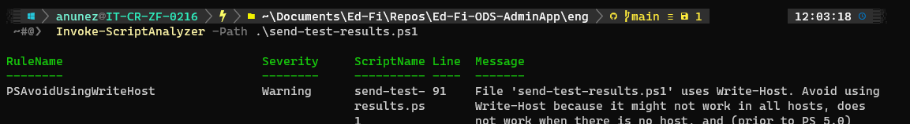
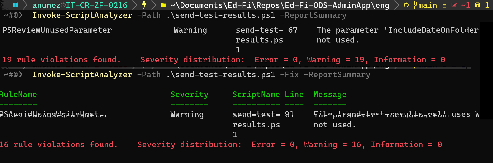

# PowerShell Linting Research

[https://docs.microsoft.com/en-us/powershell/utility-modules/psscriptanalyzer/overview](https://docs.microsoft.com/en-us/powershell/utility-modules/psscriptanalyzer/overview)

[https://docs.microsoft.com/en-us/powershell/utility-modules/psscriptanalyzer/rules-recommendation](https://docs.microsoft.com/en-us/powershell/utility-modules/psscriptanalyzer/rules-recommendation)

[https://marketplace.visualstudio.com/items?itemName=MS-SarifVSCode.sarif-viewer](https://marketplace.visualstudio.com/items?itemName=MS-SarifVSCode.sarif-viewer)

[https://sarifweb.azurewebsites.net/Validation](https://sarifweb.azurewebsites.net/Validation)

Complains about informationalUri but I'm not sure what to include, and the C#
analyzer doesn't output it either.

```
# Ideally should only install if it is missing, using Get-Module to detect

install-module -Name PSScriptAnalyzer -Force

# Reformat a file
	Invoke-Formatter -ScriptDefinition (Get-Content -Path TheFile.ps1 -Raw) | Out-File TheFile.ps1

# Analyze all files in a directory and its child directories
Invoke-ScriptAnalyzer -Path . -Recurse
```

Sample output:

```
RuleName                            Severity     ScriptName Line  Message
--------                            --------     ---------- ----  -------
PSReviewUnusedParameter             Warning      Install-Ev 59    The parameter 'LMSToolkitVeresion' has been declared but
                                                 erything.p       not used.
                                                 s1
PSAvoidUsingEmptyCatchBlock         Warning      Install-St 66    Empty catch block is used. Please use Write-Error or throw
                                                 arterKit.p       statements in catch blocks.
```

The results above are from a PowerShell object, thus manipulatable in PowerShell

```
$results = Invoke-ScriptAnalyzer -Path . -Recurse

# The first message
$results[0].Message

# Filter for errors
$results | Where-Object { $_.Severity -eq "Error" }

# Filter for errors and warnings
$results | Where-Object { $_.Severity -in ("Error", "Warning") }
```

Convert to a [sarif](https://github.com/microsoft/sarif-tutorials) file for
uploading into GitHub

> [!TIP] Docker Testing Since this code will eventually run on a Linux container
> in GitHub, let's make sure it runs...
>
> ```
> # In window 1
> docker run -it --name ps mcr.microsoft.com/powershell pwsh
>
> # In window 2 (different shell because the first one is occupied by the running command)
> docker cp analyze.ps1 ps:/opt
>
> # Back to window 2, you're now at a powershell prompt inside the container
> # If Install-Module fails below, disconnect from VPN and then run:
> #     Register-PSRepository -Default
>
> Install-Module PSScriptAnalyzer -Force
> cd opt
> ./analyze.ps1
>
> less results.sarif
> ```

---

Research 07 Sep 2022 :

GitHub Action:
[https://github.com/microsoft/psscriptanalyzer-action](https://github.com/microsoft/psscriptanalyzer-action)

- Doesn't seem to be active, there are no responses to issues and open PRs.

Notes from documentation:

- Need to mention how to skip rule:
  [https://docs.microsoft.com/en-us/powershell/utility-modules/psscriptanalyzer/using-scriptanalyzer?view=ps-modules#suppressing-rules](https://docs.microsoft.com/en-us/powershell/utility-modules/psscriptanalyzer/using-scriptanalyzer?view=ps-modules#suppressing-rules)
- Custom rules:
  [https://docs.microsoft.com/en-us/powershell/utility-modules/psscriptanalyzer/using-scriptanalyzer?view=ps-modules#custom-rules](https://docs.microsoft.com/en-us/powershell/utility-modules/psscriptanalyzer/using-scriptanalyzer?view=ps-modules#custom-rules)

SARIF Tutorial:
[https://github.com/microsoft/sarif-tutorials](https://github.com/microsoft/sarif-tutorials)

- For future reference: Once this implementation is done, should we consider
  migrating other linting results into SARIF format for compatibility

## Exploration

- Locally, will be executing script
  [https://github.com/Ed-Fi-Alliance-OSS/Ed-Fi-ODS-AdminApp/blob/main/eng/send-test-results.ps1](https://github.com/Ed-Fi-Alliance-OSS/Ed-Fi-ODS-AdminApp/blob/main/eng/send-test-results.ps1)

- Run: `Install-Module -Name PSScriptAnalyzer -Force`.
- Run: `Invoke-ScriptAnalyzer -ScriptDefinition '"b" = "b"; function
eliminate-file () { }'` to verify that module is working.
- Run:  `Invoke-ScriptAnalyzer -Path .\send-test-results.ps1` from eng folder.



- Test with -Fix fixes what's possible and prints the remaining results.
- Run with -ReportSummary  to get more details about results.



More information about the options:
[https://docs.microsoft.com/en-us/powershell/module/psscriptanalyzer/invoke-scriptanalyzer?view=ps-modules](https://docs.microsoft.com/en-us/powershell/module/psscriptanalyzer/invoke-scriptanalyzer?view=ps-modules)

Explore
[https://github.com/microsoft/ConvertToSARIF](https://github.com/microsoft/ConvertToSARIF)
