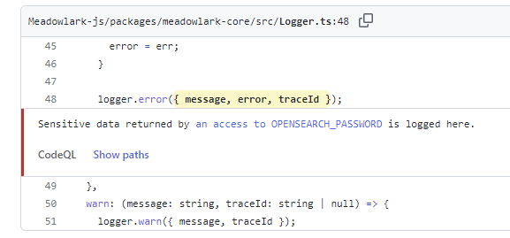
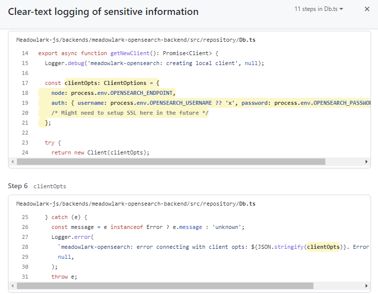

# Code Security Guidelines

## Goals

The Ed-Fi Alliance must ensure, to the extent possible, that it releases high
quality software products that operate _correctly_ and _securely_ in various
deployment environments. In addition to periodic third-party review of
applications including Ed-Fi ODS/API and Ed-Fi ODS Admin App, the following
policies are designed to protect against deliberate or accidental inclusion of
malicious code and security vulnerabilities. These policies cover the entire
"supply chain": protecting software from the moment that code changes are
accepted by the development team through the build process and final
distribution (where applicable) of compiled software to the Ed-Fi Community.

## Policy

1. **GitHub:** all Ed-Fi source code is stored on GitHub
   1. [Ed-Fi-Alliance](https://github.com/ed-fi-alliance): legacy, new code
      repositories should not use.
   2. [Ed-Fi-Alliance-OSS](https://github.com/Ed-Fi-Alliance-OSS): for open
      source, core software projects
   3. [Ed-Fi-Closed](https://github.com/Ed-Fi-Closed): for closed source, core
      software projects
   4. [Ed-Fi-Exchange-OSS](https://github.com/Ed-Fi-Exchange-OSS): for open
      source non-core (Ed-Fi Exchange) software projects
2. **2FA:** all GitHub users in the Ed-Fi organizations are required to have
   two-factor authentication, enforced through GitHub itself.
3. **Authorization by role**
   1. Owner: all Ed-Fi tech team staff, and contractors on a limited as-needed
      basis.
   2. Maintain: the EdFiBuildAgent "service account" in GitHub can have
      maintainer access in a repository, allowing its access token to create
      commits when performing version number updates or creating releases.
      1. This account is accessible only to Ed-Fi staff members Stephen Fuqua
         and Vinaya Mayya.
   3. Member:
      1. Ed-Fi core software contractors are granted Member in any of the
         organizations needed.
      2. Open source contributors can be granted Outside Collaborator access;
         this particularly useful for Ed-Fi Exchange projects.
      3. Each person should receive the least privilege applicable to their
         role on a given project.
      4. Access to the "Ed-Fi-Closed" organization is more restricted than
         the others, not only because of the closed source nature of the
         projects, but also due to the need to pay for GitHub user seats in
         this organization.
   4. Access rights are reviewed whenever there is a change to team
      composition, so that authorization can be removed when no longer needed.
4. **Branch Security**

   ***

   1. The `main`  branch is special and needs to be protected at all times,
      and must require pull requests.
      1. Where applicable, the EdFiBuildAgent account can be allowed to
         bypass pull request for automation, e.g. when bumping a version
         number on merged code.
      2. All commits should be signed in order to avoid git user spoofing
         (see [Signing Git
         Commits](https://edfi.atlassian.net/wiki/spaces/ETKB/pages/20875476/Signing+Git+Commits)).
      3. All submitters must sign the [Individual Contributors License
         Agreement](https://gist.github.com/EdFiBuildAgent/d68fa602d07505c3682e8258b7dc6fbc).
      4. Linear history is required.
      5. All status checks should pass before merge.
      6. Do not allow bypassing.
      7. Block forced pushes.
   2. In order to create patch releases safely, branches named `patch-*`
      should receive the same protection.
   3. Other branches are treated as feature branches and do not need branch
      security, as releases will not be made from those branches.
   4. Use Rulesets instead of Branch Protection, as they are more flexible
      (cf [GitHub Rulesets vs Branch
      Protections](rulesets-vs-branch-protections.md)).

<details>
  <summary><b>Exported rules from LMS-Toolkit</b></summary>

```json
{
  "id": 580376,
  "name": "main",
  "target": "branch",
  "source_type": "Repository",
  "source": "Ed-Fi-Exchange-OSS/LMS-Toolkit",
  "enforcement": "active",
  "conditions": {
    "ref_name": {
      "exclude": [],
      "include": ["~DEFAULT_BRANCH", "refs/heads/patch-*"]
    }
  },
  "rules": [
    {
      "type": "deletion"
    },
    {
      "type": "non_fast_forward"
    },
    {
      "type": "creation"
    },
    {
      "type": "required_linear_history"
    },
    {
      "type": "required_signatures"
    },
    {
      "type": "pull_request",
      "parameters": {
        "required_approving_review_count": 1,
        "dismiss_stale_reviews_on_push": false,
        "require_code_owner_review": true,
        "require_last_push_approval": true,
        "required_review_thread_resolution": false
      }
    },
    {
      "type": "required_status_checks",
      "parameters": {
        "strict_required_status_checks_policy": false,
        "required_status_checks": [
          {
            "context": "license/cla"
          }
        ]
      }
    }
  ],
  "bypass_actors": []
}
```

</details>
<br>

> [!WARNING]
> New requirement as of 28 Mar 2024 , will gradually be
> enforced across the Alliance's repositories.

1. **Injection of Dangerous or Malicious Code**

   1. Pull requests on all code provide an opportunity for human review to
      ensure that there is no unexpectedly functionality, such as statements
      that transfer data out to a third party, change filesystem permissions,
      or provide end-users with opportunities to execute code in inappropriate
      contexts.
      1. Example of an "appropriate context" for runtime injection of
         executable code: Data Import's pre-processing scripts. Risk is
         ameliorated by placing Data Import in safe network zones and
         limiting user access to Ed-Fi system administrators.
   2. Protect against [Trojan Source](https://trojansource.codes/) attacks.
   3. Use GitHub CodeQL as a static application security testing (SAST) tool
      to search for potential security vulnerabilities.
      
      Not available for closed source applications.
        <details>
        <summary>
            Example of accidentally dangerous code...
        </summary>

      This example comes from the Meadowlark R&D project. In that project, the
      development team has been developing a pure prototype application, and
      the team (which includes this author) relaxed some standards for the
      sake of expediency. However, there is some potential for this code
      "graduate" up to production status - in which case, it better not have
      security vulnerabilities! Here is a vulnerability that CodeQL discovered
      during a GitHub Action workflow run:

        

      Clicking on show paths to drill down...

        

      
      
      😲 When there's an error connecting to OpenSearch, the entire set of
      connection information gets logged! And this doesn't even have the
      excuse of being a debug setting!
        </details>
        <br>

   4. Use an appropriate [dependency review
      tool](../continuous-integration/dependency-security-automation.md) to
      ensure that libraries/packages used by an application do not have known
      vulnerabilities.

2. **Distribution**

   1. Compile and/or build distribution packages in the continuous integration
      (CI) environment - not on a developer workstation.
      1. In 2022, currently transitioning from TeamCity to GitHub.
   2. Automate upload of built packages into an appropriate, secure, storage
      location:

      | Language / Framework         | Application | Package Type       | Distribution Channel |
      | ---------------------------- | ----------- | ------------------ | -------------------- |
      | ​.NET                        | (default)   | NuGet              | Azure Artifacts​     |
      | Analytics Middle Tier        | zip         | GitHub Release     |
      | Learning Standards Sync Tool | zip         | Azure Blob Storage |
      | Python                       | (default)   | wheels             | PyPi                 |
      | TypeScript / JavaScript      | (default)   | npm                | Azure Artifacts      |
      | MetaEd (see box below)       | npm         | MyGet              |

      > 
      > Azure Artifacts requires that npm packages are scoped, e.g.
      > `@edfi/whatever`  instead of just `whatever` . Atom text editor seems
      > to have a bug that prevents it from working with scoped packages.
      > Therefore MetaEd is stuck with the legacy MyGet account.

   3. 
      The Alliance generally will not distribute packages from Ed-Fi Exchange
      repositories.

## Procedures

- **New repository setup**:
  - Apply all branch security rules described above.
  - Carefully apply least required privilege authorization to the repository.
- **Automated review**:
  - All core repositories should have appropriate automation workflows in
    GitHub. See [Guidelines for Use of GitHub
    Actions](../guidelines-for-use-of-github-actions.md)
    for more detail. Exceptions:
    - **Ed-Fi-Docker**: vulnerability scanning provided by Docker Hub, rather
      than GitHub Actions
    - **Standards**: do not contain source code
      - **Ed-Fi-Model**
      - **Ed-Fi-Standard**
      - **Ed-Fi-TPDM-Artifacts**
    - **Starter Kits** that do not contain any scannable code or actions:
      - **Ed-Fi-Starter-Kit-Assessments**
      - **Ed-Fi-Starter-Kit-Equity**
  - Ideally, create the Code Scanning and Dependency Review workflows
    immediately on creation of a new repository.
