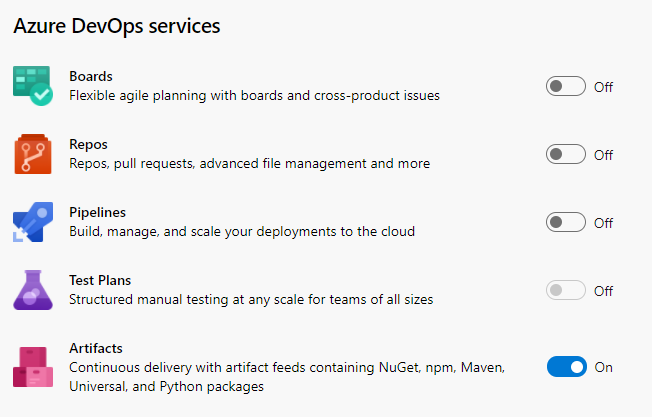
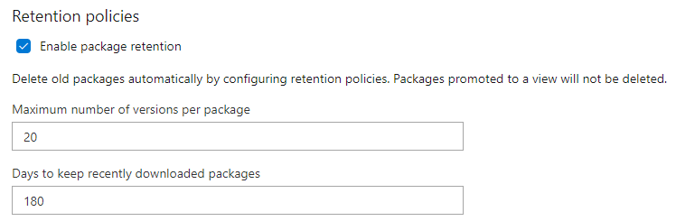
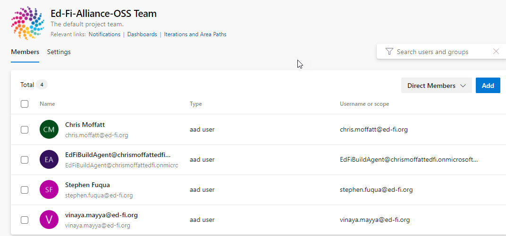
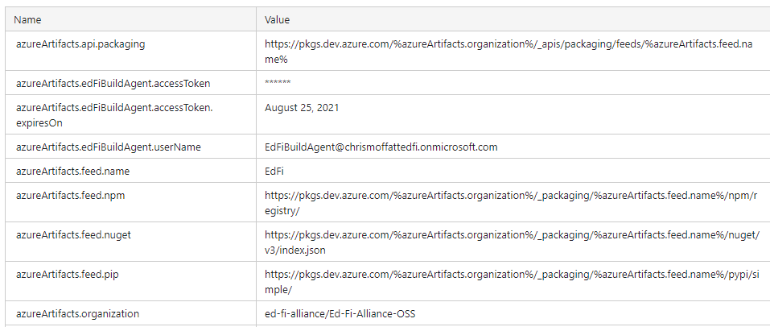
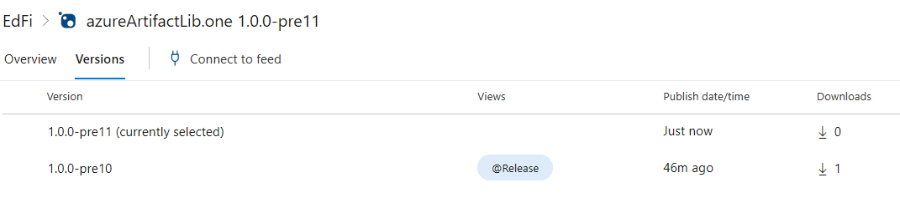

# Azure Artifacts Setup

## Organization-level Settings

[https://dev.azure.com/ed-fi-alliance/](https://dev.azure.com/ed-fi-alliance/)

## Billing

Billing has been linked to the "EdFiBuildAgent" Azure subscription.

## Users

[https://dev.azure.com/ed-fi-alliance/\_settings/users](https://dev.azure.com/ed-fi-alliance/_settings/users)

Can add users who are created in ~Active Directory~ Entra, on Azure
subscription `chrismoffattedfi`, or can add Visual Studio subscribers, or
[Stakeholders](https://docs.microsoft.com/en-us/azure/devops/organizations/security/get-started-stakeholder?view=azure-devops&tabs=agile-process).
Stakeholders can have full access to Azure Artifacts, so this *should* be a way
to add development contractors if needed (e.g. for promoting a package to the
Release view).

# Ed-Fi-Alliance-OSS Project 

The Artifacts are under [project
Ed-Fi-Alliance-OSS](https://dev.azure.com/ed-fi-alliance/Ed-Fi-Alliance-OSS)
([project
settings](https://dev.azure.com/ed-fi-alliance/Ed-Fi-Alliance-OSS/_settings/)).

Administrators are: Jason, Stephen, Steven,
Vinaya. 

it is possible to add other administrators, but once granted, there is no
obvious way to *remove* administrative access on the project.

## Enabled Services

Should not change these services without discussion.



## Organization Owner

Stephen Fuqua is the organization owner. This can be changed to another
organization member in the [organization Overview settings
page](https://dev.azure.com/ed-fi-alliance/_settings/organizationOverview).

## Package Feed URLs

- NuGet: [https://pkgs.dev.azure.com/ed-fi-alliance/Ed-Fi-Alliance-OSS/\_packaging/EdFi/nuget/v3/index.json](https://pkgs.dev.azure.com/ed-fi-alliance/Ed-Fi-Alliance-OSS/_packaging/EdFi/nuget/v3/index.json)
- NPM: [https://pkgs.dev.azure.com/ed-fi-alliance/Ed-Fi-Alliance-OSS/\_packaging/EdFi/npm/registry/](https://pkgs.dev.azure.com/ed-fi-alliance/Ed-Fi-Alliance-OSS/_packaging/EdFi/npm/registry/)
- PIP: [https://pkgs.dev.azure.com/ed-fi-alliance/Ed-Fi-Alliance-OSS/\_packaging/EdFi/pypi/simple/](https://pkgs.dev.azure.com/ed-fi-alliance/Ed-Fi-Alliance-OSS/_packaging/EdFi/pypi/simple/)

## Retention Policies



## Project Team



The "EdFiBuildAgent" account in the "Contributors" Group: "Members of this group
can add, modify, and delete items within the team project."

# Operations

## Automation Goals

1. Publish pre-release and/or release packages to Azure Artifacts
2. Promote a version to a "release", thus preventing it from being purged

## Parameters in TeamCity

These parameters are setup at the root level and are thus available to all
projects within TeamCity.



> [!CAUTION]
> Microsoft requires an expiration date on personal access tokens,
> max one year out. Thus this value will need to be updated periodically.
> Sign in to the project with this user account and then go to the Profile page
> to create a new token. The password is available to Ed-Fi tech team members in
> Password Manager Pro.

## Pushing a Package to the Feed

Publishing / pushing a package to Azure Artifacts requires authentication. The
authentication mechanism is different than the one built into nuget.exe. The
simplest way to work with it from TeamCity is to use the `NuGet feed
credentials`  as shown below.

_
image was lost in the Confluence
migration _

This screenshot is for illustration / POC only. Within TeamCity, the feed URL,
username, and password will be provided as parameters and will use the
EdFiBuildAgent account instead of Stephen's credentials. The password is not the
user's password, but rather an access token.

NuGet.exe requires that API key be provided at the command line; however, Azure
Artifacts will ignore the value. Thus any random value will do the trick.

**Kotlin Code for Feed Credentials**

```
package ...

... imports
import jetbrains.buildServer.configs.kotlin.v2019_2.buildFeatures.nuGetFeedCredentials

object XYZ : ABC({

    features {
        nuGetFeedCredentials {
            feedUrl = "%azureArtifacts.feed.nuget%"
            username = "%azureArtifacts.edFiBuildAgent.userName%"
            password = "%azureArtifacts.edFiBuildAgent.accessToken%"
        }
    }

})
```

> [!TIP]
> **Proof of concept:**
>  [https://intedfitools1.msdf.org/buildConfiguration/Experimental_AzureArtifactsPoc](https://intedfitools1.msdf.org/buildConfiguration/Experimental_AzureArtifactsPoc)

## Promoting a Package to Release View

This has the effect of "pinning" the package so that it will not be purged
through the retention policy.

Documentation on the packagesBatch API endpoint used below: [NuGet - Update
Package
Versions](https://docs.microsoft.com/en-us/rest/api/azure/devops/artifactspackagetypes/nuget/update%20package%20versions?view=azure-devops-rest-5.0).

```
$user = "%azureArtifacts.edFiBuildAgent.userName%"
$pass = ConvertTo-SecureString -String "%azureArtifacts.edFiBuildAgent.accessToken%" -AsPlainText -Force
$credential = New-Object -TypeName System.Management.Automation.PSCredential -ArgumentList $user, $pass
$body = @{
	data = @{
		viewId = "Release"
	}
	operation = 0
	packages = @(
		@{
			id = "%nuget.package.name%"
			version = "%nuget.package.version%"
			protocolType = "NuGet"
		}
	)
}

$parameters = @{
	Method = "POST"
	ContentType = "application/json"
	Credential = $credential
	URI = "%azureArtifacts.api.packaging%/nuget/packagesBatch?api-version=5.0-preview.1"
	Body = ConvertTo-Json $body
}
Write-Host @parameters
Invoke-RestMethod @parameters
```

> [!TIP]
> **Proof of concept:** [https://intedfitools1.msdf.org/buildConfiguration/Experimental_SFuqua_PromoteAzureArtifactToRelease/87650?buildTab=log&focusLine=3&linesState=21](https://intedfitools1.msdf.org/buildConfiguration/Experimental_SFuqua_PromoteAzureArtifactToRelease/87650?buildTab=log&focusLine=3&linesState=21)
> After running the above command, the designated version has been promoted. In
> the following screenshot you can see that 1.0.0-pre10 has been promoted to
> Release status, but 1.0.0-pre11 has not.
> 

> [!TIP]
> Change `protocolType`  to `npm`  or `pip` (or is it `pypi`?) as needed.

## Manual Package Publishing

### NuGet.exe

Pushing manually requires a Username and Personal Access Token (PAT). To create
your own see Microsoft's docs: [Create a
PAT](https://docs.microsoft.com/en-us/azure/devops/organizations/accounts/use-personal-access-tokens-to-authenticate?view=azure-devops&tabs=preview-page#create-a-pat).

#### Add a Source

```
nuget sources add -name EdFiAzure -source https://pkgs.dev.azure.com/ed-fi-alliance/Ed-Fi-Alliance-OSS/_packaging/EdFi/nuget/v3/index.json -username <UserName> -password <Pat>
```

> [!WARNING]
> If the source is already registered you can remove a source by name.
>
> #### List Sources
>
> ```
> nuget sources
> ```
>
> #### **Remove a Source**
>
> ```
> nuget sources remove -name <SourceName>
> ```

#### **Push a Package**

```
nuget push -source https://pkgs.dev.azure.com/ed-fi-alliance/Ed-Fi-Alliance-OSS/_packaging/EdFi/nuget/v3/index.json -apikey <PAT> .\SomePackage.nupkg
```

For more information see Microsoft's docs: [Create and publish your own NuGet
package](https://docs.microsoft.com/en-us/azure/devops/artifacts/nuget/publish?view=azure-devops#create-and-publish-your-own-nuget-package).

### Dotnet.exe

1. Install the
   [artifacts-credprovider](https://github.com/Microsoft/artifacts-credprovider/blob/master/README.md).
2. In PowerShell, setup an environment variable like so:

   ```
   $env:VSS_NUGET_EXTERNAL_FEED_ENDPOINTS = '{"endpointCredentials": [{"endpoint":"https://pkgs.dev.azure.com/ed-fi-alliance/Ed-Fi-Alliance-OSS/_packaging/EdFi/nuget/v3/index.json", "password":"your personal access token here"}]}'
   ```

3. Push the package

   ```
    dotnet nuget push -s https://pkgs.dev.azure.com/ed-fi-alliance/Ed-Fi-Alliance-OSS/_packaging/EdFi/nuget/v3/index.json .\EdFi.Suite3.Db.Deploy.2.0.0.nupkg --api-key az
   ```

---

[Organization-level Settings](#organization-level-settings) |
[Billing](#billing) | [Users](#users) |
[Ed-Fi-Alliance-OSS Project](#ed-fi-alliance-oss-project) |
[Enabled Services](#enabled-services) | [Organization
Owner](#organization-owner) | [Package Feed
URLs](#package-feed-urls) | [Retention
Policies](#retention-policies) | [Project
Team](#project-team) |
[Operations](#operations) | [Automation
Goals](#automation-goals) | [Parameters in
TeamCity](#parameters-in-teamcity) | [Pushing a Package to the
Feed](#pushing-a-package-to-the-feed) | [Promoting a Package to
Release View](#promoting-a-package-to-release-view) | [Manual
Package Publishing](#manual-package-publishing) |
[NuGet.exe](#nugetexe) | [Add a
Source](#add-a-source) | [List
Sources](#list-sources) | [Remove a
Source](#remove-a-source) | [Push a
Package](#push-a-package) |
[Dotnet.exe](#dotnetexe)
