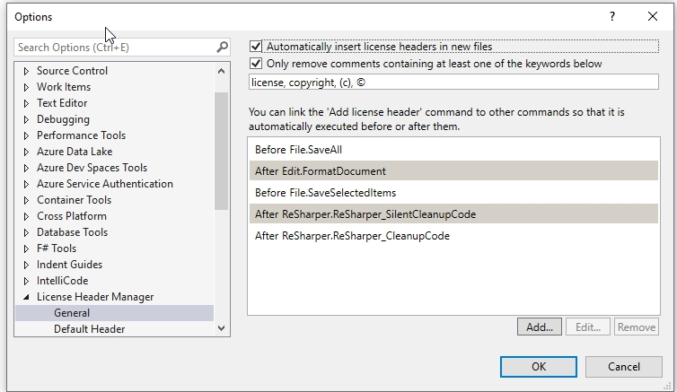
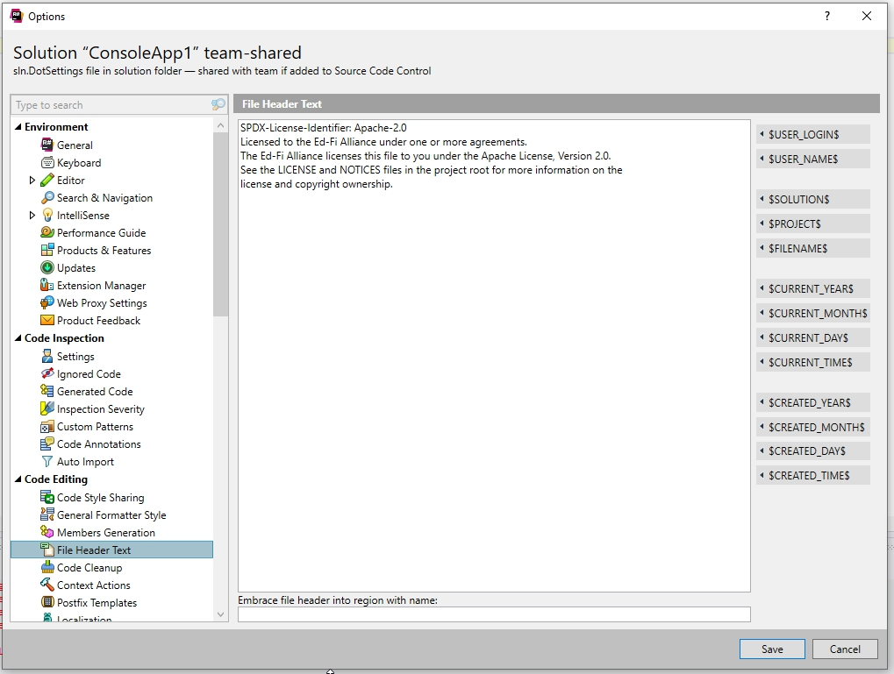

# Analysis Spike: Tool Support for File Headers

## Goal

As we move to open source software, we need a methodology that will allow the
core development team, and contributions from the community  to contain the
license information within the files being checked into the repository. R# has
the ability to to add license information by adding a template to the
team-shared file. However, being a paid product, this puts a burden on the
developers that cannot afford the cost of the product. Also this only works with
C# or Visual Basic files.

## Solution Considerations

The following requirements are considered in this solution:

1. Low cost solution that does not put a burden other developers.
2. Needs to minimize code churn during the pull request process.
   1. Ideally we do not want to force another commit just to apply the header
      for the code from an external resource. Though this could be done using a
      build server, it is also error prone.
3. Should make it simple as possible to maintain standards.

## Recommendation

There is a Visual Studio extension ([License Header
Manager](https://marketplace.visualstudio.com/items?itemName=StefanWenig.LicenseHeaderManager))
that allows for creating a license template that can be applied against file
extensions. Preliminary testing is positive, that we can apply an license file
against the code base. The tool is license with a MIT license, and has no cost.
This tool can be added as a requirement for the developer setup. A sample
template looks as follows:

```
extensions: designer.cs generated.cs
extensions: .cs .cpp .h .js
// SPDX-License-Identifier: Apache-2.0
// Licensed to the Ed-Fi Alliance under one or more agreements.
// The Ed-Fi Alliance licenses this file to you under the Apache License, Version 2.0.
// See the LICENSE and NOTICES files in the project root for more information on the
// license and copyright ownership.

extensions: .aspx .ascx
<%--
   SPDX-License-Identifier: Apache-2.0
   Licensed to the Ed-Fi Alliance under one or more agreements.
   The Ed-Fi Alliance licenses this file to you under the Apache License, Version 2.0.
   See the LICENSE and NOTICES files in the project root for more information.
--%>

extensions:  .xml .config .xsd .cshtml .html
<!--
   SPDX-License-Identifier: Apache-2.0
   Licensed to the Ed-Fi Alliance under one or more agreements.
   The Ed-Fi Alliance licenses this file to you under the Apache License, Version 2.0.
   See the LICENSE and NOTICES files in the project root for more information.
-->


```

Configuration is relatively simple and the following works with or without
Resharper.



Though there are some known challenges with Resharper, but a work around does
exists by adding the license text in Reshaper.



Testing with the above configuration I was able to apply the templates to all C#
classes, html files, JavaScript, razor pages, xml, and xsd with a simple right
click. The tool also added the license automatically on save, for these file
types. For Visual Studio License Header Manager, ticks the boxes above, and is
the recommendation.

For VS Code there is also an extension named [License Header
Manager](https://marketplace.visualstudio.com/items?itemName=angelo-breuer.license-header-manager#adding-support-for-your-language).
Configuration of VS Code and the workspace is required, and this should be
explored.

The ODS/API solution consists of three repositories with the following file
counts by extension:

| Extension     | Count | Notes                                                                                      |
| ------------- | ----- | ------------------------------------------------------------------------------------------ |
| .asax         | 2     |                                                                                            |
| .bat          | 1     |                                                                                            |
| .config       | 52    |                                                                                            |
| .Config       | 3     |                                                                                            |
| .cs           | 1747  |                                                                                            |
| .cshtml       | 24    |                                                                                            |
| .csproj       | 57    |                                                                                            |
| .css          | 5     |                                                                                            |
| .dll          | 2     | executable                                                                                 |
| .eot          | 2     | font file                                                                                  |
| .feature      | 7     |                                                                                            |
| .htm          | 2     |                                                                                            |
| .html         | 2     |                                                                                            |
| .ico          | 2     | image                                                                                      |
| .js           | 8     |                                                                                            |
| .json         | 45    |                                                                                            |
| .md           | 12    |                                                                                            |
| .metaed       | 66    |                                                                                            |
| .mustache     | 17    |                                                                                            |
| .nuspec       | 12    |                                                                                            |
| .otf          | 2     | font                                                                                       |
| .pdf          | 11    | license files                                                                              |
| .png          | 40    | image<br><br>(these are duplicated multiple times)                                         |
| .props        | 2     |                                                                                            |
| .ps1          | 112   |                                                                                            |
| .ps1xml       | 2     |                                                                                            |
| .psd1         | 6     |                                                                                            |
| .psm1         | 50    |                                                                                            |
| .pubxml       | 7     |                                                                                            |
| .resx         | 1     |                                                                                            |
| .settings     | 3     |                                                                                            |
| .sln          | 9     |                                                                                            |
| .sql          | 269   | Some of these are generated by metaed.                                                     |
| .svg          | 2     | font file                                                                                  |
| .Targets      | 2     | same file in two locations                                                                 |
| .ttf          | 2     | font file                                                                                  |
| .txt          | 63    | majority are approval tests                                                                |
| .vsixmanifest | 1     |                                                                                            |
| .vstemplate   | 3     |                                                                                            |
| .woff         | 2     | font file                                                                                  |
| .xml          | 63    | majority are generated files by metaed.                                                    |
| .xsd          | 42    | majority are generated files by metaed. <br><br>(profiles and composites are an exception) |
|               | 2770  |                                                                                            |

## Open Questions:

Should generated files have the license header?  
[Stephen
Fuqua](https://edfi.atlassian.net/wiki/people/5b7c806bfe42212a79620406?ref=confluence):
yes

Should the ODS team be responsible for updating the artifacts from MetaEd? If so
is there a ticket?  
[Stephen
Fuqua](https://edfi.atlassian.net/wiki/people/5b7c806bfe42212a79620406?ref=confluence):
only those files in the apache-licensed repos, e.g. ODS-Implementation. Core
data model files are not going to be licensed under Apache and thus do not need
updates.

[Vinaya
Mayya](https://edfi.atlassian.net/wiki/people/5c34ff2db4d5d75a3b51e1b9?ref=confluence)
: This bring the question on files that are not in the solution, sql files,
PowerShell scripts etc. where the VS extension wouldn't help.

Should extensions created in the field have an Ed-Fi License?  
[Stephen
Fuqua](https://edfi.atlassian.net/wiki/people/5b7c806bfe42212a79620406?ref=confluence):
the creators can apply whatever license they want to their extensions, AFAIK.

Reference for file types: [License and Copyright
Notifications](../open-source-code-management/license-and-copyright-notifications.md)
