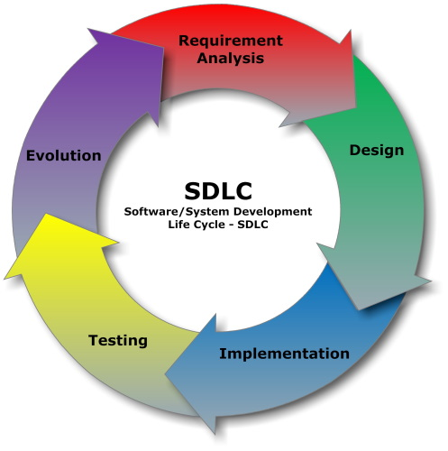

# Ed-Fi Software Development Lifecycle Home

> [!NOTE]
> Landing page for policies, guidelines, and procedures related to Ed-Fi software development. Intended for use by Ed-Fi contractors and key open-source contributors on a case-by-case basis.

## Getting Started

All developers should review the following content, in addition to reviewing relevant pages in the content listed in this SDLC space:

- [Contributor Code of Conduct](https://edfi.atlassian.net/wiki/spaces/ETKB/pages/20875353/Contributor+Code+of+Conduct)
- [Slack for the Ed-Fi Community](https://edfi.atlassian.net/wiki/spaces/ETKB/pages/20875301/Slack+for+the+Ed-Fi+Community)

## Contents

- [Coding and Testing Standards](./Coding-and-Testing-Standards/README.md)
- [Continuous Integration](./Continuous-Integration/README.md)
- [Cross-Functional Projects](./Cross-Functional-Projects/README.md)
- [Source Code Control Policy](./Source-Code-Control-Policy/README.md)

## SDLC Security Documents

:blue_book:[Signing Git Commits](./Source-Code-Control-Policy/signing-git-commits.md)

:blue_book:[Source Code Control Policy](./Source-Code-Control-Policy/README.md)

:blue_book:[Release Workflow and Supply Chain Integrity](./Continuous-Integration/Release-Workflow-and-Supply-Chain-Security/README.md)

:blue_book:[Code Security Guidelines](./Continuous-Integration/Code-Security-Guidelines/README.md)

:blue_book:[Dependency Security Automation](./Continuous-Integration/Dependency-Security-Automation/README.md)

:blue_book:[Guidelines for Use of GitHub Actions](./Continuous-Integration/guidelines-for-use-of-github-actions.md)
