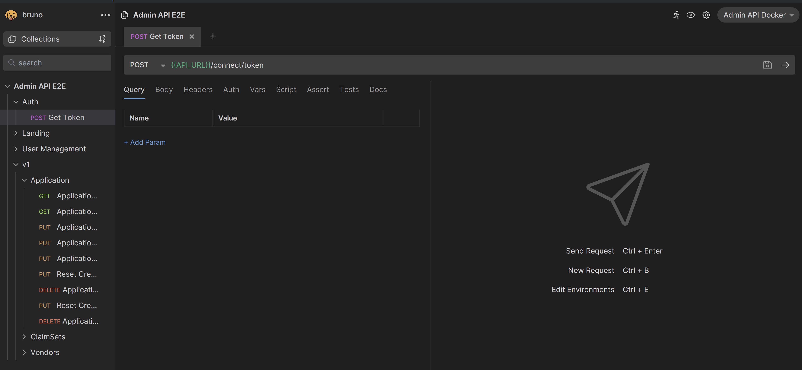
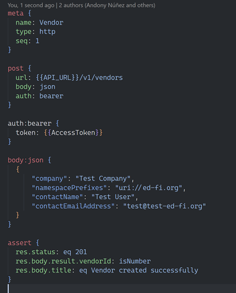
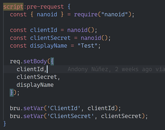
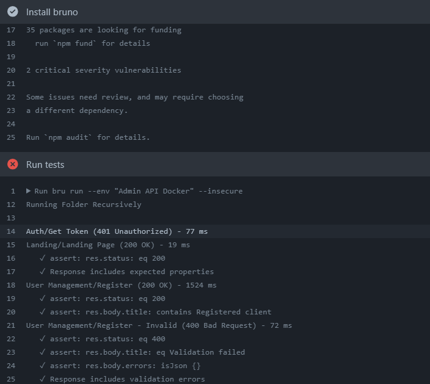
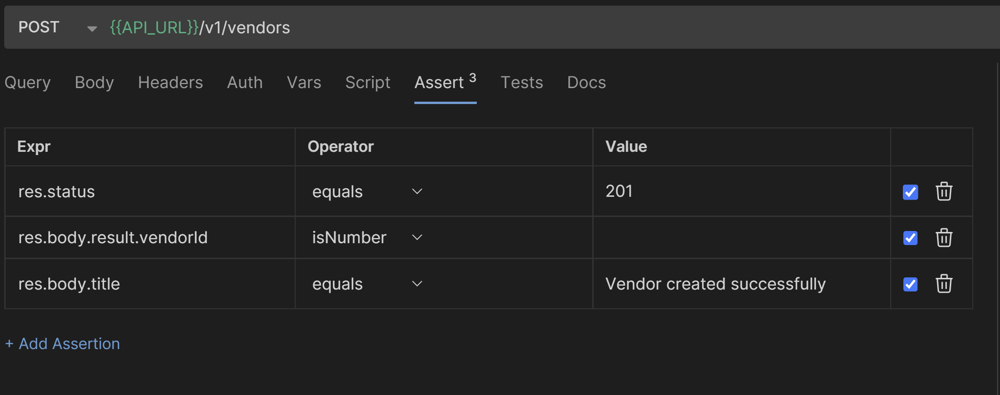

# Bruno Introduction

/> [!CAUTION] /> This document describes investigation of Bruno as an
alternative to /> Postman. Our conclusion at the time: it is close, but not
quite ready for /> Ed-Fi. Primary reason: cannot define authentication at a
parent level and have /> that cascade down to the children.

## What is Bruno?

[Bruno](https://www.usebruno.com/) is an Open Source API Client, aimed to be an
alternative to Postman and other tools for API testing, while maintaining
similarities and trying to improve the areas that other tools might not
cover/support.

## Why considering a different API Client?

When exploring test automation options for Meadowlark
([https://edfi.atlassian.net/wiki/spaces/BD/pages/22041449](https://edfi.atlassian.net/wiki/spaces/BD/pages/22041449)),
I mentioned some caveats of using Postman for test automation (based on previous
experience in developing API test suites such as Admin API's).

The [Bruno's Manifesto](https://www.usebruno.com/manifesto) mentions some of
these aspects, the biggest one being the necessity of having the collections in
source control and adding easy modification and synchronization between teams.

## How to use Bruno?

Bruno functionality consists of three areas: The UI, the Markdown and the Runner

## The UI

This is a similar, simpler version of the Postman UI, if you've used Postman
before, the

[https://www.usebruno.com/downloads](https://www.usebruno.com/downloads)

## Markdown (.bru)

[https://www.usebruno.com/bru](https://www.usebruno.com/bru)

VSCode extension for Syntax Highlighting:
[https://marketplace.visualstudio.com/items?itemName=bruno-api-client.bruno](https://marketplace.visualstudio.com/items?itemName=bruno-api-client.bruno)

Bruno has some [built in Node
libraries](https://docs.usebruno.com/scripting/inbuilt-libraries.html) and
supports adding [node packages as
dependencies](https://docs.usebruno.com/scripting/external-libraries.html)
adding a package.json file.

## Runner

[https://github.com/andonyns/Ed-Fi-AdminAPI/actions/runs/7281562133/job/19842303482](https://github.com/andonyns/Ed-Fi-AdminAPI/actions/runs/7281562133/job/19842303482)

## Added Functionality

### Assertions

Simplified tests to verify for specific results

## Missing Functionality

### Folder level scripts

- Can be added as a previous test, but will not be automatically executed.

### Step Reuse

## Demo

See
[Register.bru](https://github.com/Ed-Fi-Alliance-OSS/Ed-Fi-AdminAPI/blob/14ffada70028375fdd22d1e368992e38e208102f/Application/EdFi.Ods.AdminApi/E2E-Tests/bruno/Admin-API-E2E/User-Management/Register.bru)

## Read More

[https://docs.usebruno.com/bru-lang/overview.html](https://docs.usebruno.com/bru-lang/overview)
