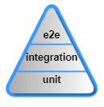

# Testing Standards

## General Principles

1. Test-driven development using the [red-green-refactor
    method](https://www.jamesshore.com/Blog/Red-Green-Refactor.html) is
    encouraged.
2. Definitions:

   

    1. **Unit tests.** Unit tests are run in isolation, with limited (ideally
        no) hard-coded dependencies on other classes, and absolutely no
        dependencies on external resources such as a database, filesystem, web
        service, or similar.
    2. **Integration tests.** These are tests that *do* connect to external
        resources, and therefore may need additional setup to prepare those
        resources and teardown to clean them up afterward.
    3. **End-to-end (E2E) tests.** These are a special case of *integration
        test* where the interaction with the system is driven end-to-end through
        a graphical user interface, console application, or other long-running
        process.
3. Ed-Fi test suites usually follow the test pyramid philosophy:
    1. Write a lot of *unit tests*, with high coverage for all but the most
        trivial code.
    2. Write *integration tests* where appropriate; though fewer in number,
        they are essential for ensuring that parts work together. Why fewer?
        Because they are usually hard to write and harder to maintain.
    3. Build *end-to-end* *tests* sparingly, as they are the most expensive to
        execute and to maintain.
4. When joining an existing project, always look at the prevailing testing
    conventions and follow them when creating new tests or modifying existing
    ones. In consultation with the primary development team and Ed-Fi Alliance
    tech staff, those prevailing conventions are open to modification — but only
    under those two conditions.
5. When it seems impossible to write a unit test, take another look: this
    usually signals the presence of a dependency that can be extracted to an
    [Adapter](https://en.wikipedia.org/wiki/Adapter_pattern) / Wrapper class and
    injected into the class under test. The Adapter / Wrapper is usually *not*
    covered by unit tests and should contain the minimum logic needed to
    redirect arguments to the real dependency class.
6. Prefer test methods that assert a single truth. However, multiple assertions
    may be necessary in cases where it is important to assert an object is not
    null before asserting a truth on one of its properties. Note that the
    following examples use Shouldly methods instead of NUnit's "Assert.XYZ"
    methods.  

    ```c#
    // Bad
    [Test]
    public void Given_some_condition_then_expect_some_results()
    {
     // ... arrange and act (execute)
    
     // ... and now Assert / validate the results
     result.PropertyOne.ShouldBe(1);
     result.PropertyTwo.ShouldBe("two");
    }
    
    
    // Good
    [Test]
    public void Given_some_condition_then_expect_property_one_to_be_1()
    {
     // ... arrange and act (execute)
    
     // ... and now Assert / validate the results
     result.PropertyOne.ShouldBe(1);
    }
    
    [Test]
    public void Given_some_condition_then_expect_property_two_to_be_2()
    {
     // ... arrange and act (execute)
    
     // ... and now Assert / validate the results
     result.PropertyTwo.ShouldBe("two");
    }
    
    // In many cases, the test suite will be rearranged so that the 
    // test setup method will execute the test and each test method
    // would contain only one line - the single assertion.
    ```

    **Guard Clause Assertions**

    ```c#
    // We don't want a null reference exception, and therefore introduce
    // a not-null guard clause assertion. The assertions with 
    // 'results.Value.Any' arguably should have been in a separate method. 
    [Test]
    public void A_test_with_guard_clauses() 
    {
     // ... arrange and act (execute)
    
     // ... and now Assert / validate the results
     result.ShouldNotBeNull();
    
     // Safely use multiple assertions once the guard clause
     // has been satisfied. Two styles shown:
    
     // native NUnit style:
     Assert.Multiple( () =>
     {
      result.Value.Length.ShouldBe(6);
      result.Value.Any(x => x.GetType() != typeof(NpgsqlParameter))
          .ShouldBeFalse();
     });
    
     // preferred Shouldly style:
     result.ShouldSatisfyAllConditions(
      () => result.Value.Length.ShouldBe(6),
      () => result.Value.Any(x => x.GetType() != typeof(NpgsqlParameter))
           .ShouldBeFalse();
     );
    }
    ```

7. Use fake objects appropriately. [Mocks are not
    stubs](https://martinfowler.com/articles/mocksArentStubs.html); take care
    not to abuse mocks by making unit tests tightly coupled to implementation.  

    :::tip

    The FakeItEasy framework does not make a strong distinction between
    mocks and stubs. Nevertheless, the point stands that mocks can be taken
    overboard, which results in brittle tests.

    :::

## Project-Specific Guidance

* [ODS Platform Testing](./ods-platform-testing.md),
    covering the ODS / API and its associated utilities (e.g., code generation,
    db deploy, migration utility)

## References

Excellent articles and online resources on the practice of testing:

* [Best Practices in Test-Driven, Object Oriented, Green- and Brownfield
    Development](https://tech.safnet.com/best-practices-tdd-oo/intro), a guide
    by Ed-Fi software architect Stephen Fuqua
* *[xUnit Test Patterns](http://xunitpatterns.com/)*, by Gerard Meszaros
* [Software Testing Guide](https://martinfowler.com/testing), articles by
    Martin Fowler and friends on his website
* [Is TDD Dead?](https://martinfowler.com/articles/is-tdd-dead/), a series of
    conversations between Kent Beck, David Heinemeier Hansson, and Martin Fowler

Good books on testing and designing for testability:

* *[Working Effectively with Legacy
    Code](https://www.goodreads.com/book/show/44919.Working_Effectively_with_Legacy_Code)*,
    by Michael C. Feathers
* *[Agile Principles, Patterns, and Practices in
    C#](https://www.oreilly.com/library/view/agile-principles-patterns/0131857258/)*,
    by Robert C. Martin and Micah Martin
* *[Clean Code: A Handbook of Agile Software
    Craftsmanship](http://www.informit.com/store/clean-code-a-handbook-of-agile-software-craftsmanship-9780132350884)*,
    by Robert C. Martin
* *[Refactoring: Improving the Design of Existing
    Code](https://refactoring.com/)*, by Martin Fowler
* *[Design Patterns: Elements of Reusable Object-Oriented
    Software](http://www.informit.com/store/design-patterns-elements-of-reusable-object-oriented-9780201633610)*,
    by Erich Gamma, Richard Helm, Ralph Johnson, and John Vlissides
* *[Enterprise Integration Patterns: Designing, Building, and Deploying
    Messaging Solutions](https://www.enterpriseintegrationpatterns.com/)*, by
    Gregor Hohpe, Bobby Woolf, et al.
* *[Implementation
    Patterns](https://www.oreilly.com/library/view/implementation-patterns/9780321413093/)*,
    by Kent Beck
* *[Patterns of Enterprise Application
    Architecture](https://martinfowler.com/books/eaa.html)*, by Martin
    Fowler, et al.
