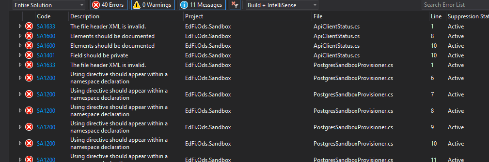
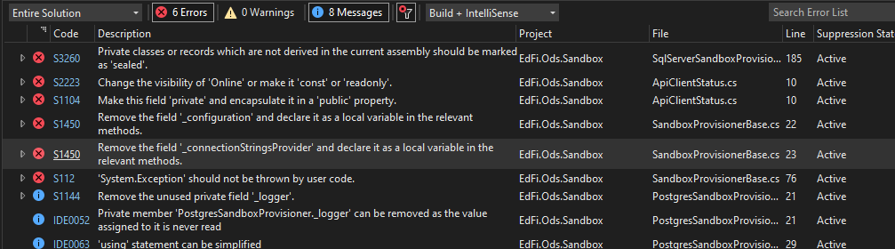

# Background Research - C# Linter

# Incumbent - ReSharper

Most of the .NET development team for Ed-Fi has ReSharper,
 which does not satisfy
both 4 and 5 at the same time. That said, it is not very expensive - only a few
hundred dollars per person per year.

## Command Line Option

Historically we have not used it at the command line. JetBrains provides a
[command line
utility](https://www.jetbrains.com/help/resharper/ReSharper_Command_Line_Tools.html)
as a dotnet tool ([detailed usage
instructions](https://www.jetbrains.com/help/resharper/InspectCode.html#usage-scenarios)).
This is a  "free
cross-platform standalone tool". It is configurable via .editorconfig or
.DotSettings file, just like ReSharper. At the command line, you can instruct it
to inspect only particular projects instead of the entire solution, and there is
a wildcard include/exclude option for file matching. Example run and output:

```
PS C:\source\tmp\ed-fi-ods-implementation\Application> jb inspectcode .\Ed-Fi-Ods.sln
JetBrains Inspect Code 2021.3.3
Running on AMD 64 in 64-bit mode, .NET Core 3.1.22 under Microsoft Windows 10.0.19044
Warning: Starting from version 2021.2, InspectCode builds the target solution before starting the analysis to make sure it only finds relevant code issues.
To explicitly accept the new behavior and suppress this warning, use the '--build' option.
To match the behavior in previous versions and skip the build, use '--no-build'.
Using toolset version 17.0 from "C:\Program Files\Microsoft Visual Studio\2022\Professional\MSBuild\Current\Bin"
Configuration: Debug, Platform: Any CPU
Referenced project 'EdFi.Admin.DataAccess' not found in the solution, switched to output assembly.
Referenced project 'EdFi.Security.DataAccess' not found in the solution, switched to output assembly.
Referenced project 'EdFi.Common' not found in the solution, switched to output assembly.
Referenced project 'EdFi.Admin.DataAccess' not found in the solution, switched to output assembly.
Referenced project 'EdFi.Security.DataAccess' not found in the solution, switched to output assembly.
Referenced project 'EdFi.Common' not found in the solution, switched to output assembly.
Output file is not specified.
PS C:\source\tmp\ed-fi-ods-implementation\Application> $LASTEXITCODE
1
```

Generating and parsing an output file (XML) would be necessary for build
automation. Did not yet research availability of any existing parsers /
reporters.

Using PowerShell `Measure-Command` , it took 00:00:31.794  to run with the
`--no-build`  option and 00:01:14.873 with the default `--build`  option.

`measure-command { jb inspectcode .\Ed-Fi-Ods.sln }`

[https://www.jetbrains.com/help/resharper/InspectCode.html#inspection-parameters](https://www.jetbrains.com/help/resharper/InspectCode.html#inspection-parameters)

## Alternative - StyleCop

Venerable and still powerful style checker from Microsoft. Installation is via
NuGet package (StyleCop.Analyzers).  Supports editorconfig
([example](https://github.com/DotNetAnalyzers/StyleCopAnalyzers/blob/master/.editorconfig)).

## Alternative - Roslyn Analyzers

The old FxCop was replaced by the powerful Roslyn Analyzers. Visual Studio has a
built-in capability of using these analyzers across projects. Outside of Visual
Studio, one can manually add the analyzers to all projects as NuGet packages.
These will then execute at build time.  Rules [can be
configured](https://docs.microsoft.com/en-us/visualstudio/code-quality/in-source-suppression-overview?view=vs-2022)
via .editorconfig file.

Installation is via NuGet package (Microsoft.CodeAnalysis.CSharp).

[https://docs.microsoft.com/en-us/visualstudio/code-quality/use-roslyn-analyzers?view=vs-2022](https://docs.microsoft.com/en-us/visualstudio/code-quality/use-roslyn-analyzers?view=vs-2022)

## Alternative - SonarLint

[SonarLint](https://www.sonarlint.org/) is a free tool provided by the makers of
SonarQube. It does not integrate with SonarQube: it seems to be a one-stop-shop
for many different languages and integrating many existing toolkits. Like other
tools, it [can be
configured](https://community.sonarsource.com/t/using-editorconfig-instead-of-ruleconfig/44299)
via .editorconfig. The documentation is a little spartan, but it is using the
same Roslyn system behind the scenes as Microsoft's tools, and MS's
documentation helps fill the gaps.

Installation is via NuGet package (SonarAnalyzer.CSharp). Errors and warnings
will show up at compile time. These, as well as additional suggestions ("info"
level) will also show up in the IDE (Visual Studio

An example ruleset:
[https://gist.github.com/srmagura/744ec1f356515eb3fe4b829f89c21a8c](https://gist.github.com/srmagura/744ec1f356515eb3fe4b829f89c21a8c).
Referenced from this blog
post: [https://dev.to/srmagura/c-linting-and-formatting-tools-in-2021-bna](https://dev.to/srmagura/c-linting-and-formatting-tools-in-2021-bna)

Covers many different languages, including T-SQL. Should look into that.

## Comparison

EdFi.Ods.Sandbox project

### JetBrains

Slow and did not generate any useful insights on its own - see the sample output
above. Reported all of the StyleCop problems after that tool was installed.

Funny thing is, Resharper *does* detect many problems in this project. So this
tool is either not working properly or I cannot determine how to work it
properly.

### StyleCop

In Visual Studio:



At the command line, simply run `dotnet build` . Completed in 7 seconds compared
to > 30 seconds for JetBrains. Many of these rules look quite useful.

### Roslyn Analyzers

Either I can't figure out how to use them, or they are not detecting anything
new during the build process. Might be adding more functionality to Visual
Studio's built-in code analysis capability, but that's not what we're after.

### SonarLint

This one detected some additional issues that were no flagged by the other
tools.



#### Recommendation

Use a combination of StyleCop and SonarLint in C# projects.

- Stephen to do an initial analysis on ODS/API solution, Admin App, and
  Analytics Middle Tier to identify _proposed_ rules to throw out.
  - Representative sample, rather than everything we have
  - Anything already covered in our existing C# guidelines should be adopted
    automatically without further review
- Review outcomes with product owners
- Create a common editorconfig file from this
- Add these editorconfig settings to all C# repositories.
- Incrementally add the two nuget packages to projects. Teams are responsible
  for this. This way they can fix up issues one project at a time, which makes
  it less burdensome.
- Disable many desired features and incrementally re-enable them, so that PR's
  don't immediately break. Individual tickets to fix them up.
- [https://github.com/RehanSaeed/EditorConfig/blob/main/.editorconfig](https://github.com/RehanSaeed/EditorConfig/blob/main/.editorconfig)
- PROBLEM: how to get these reports into GitHub? How to get build errors
  anywhere other than in Visual Studio?

```C#
<PackageReference Include\="Microsoft.CodeAnalysis.CSharp.CodeStyle" Version\="4.2.0"\>
    <PrivateAssets\>all</PrivateAssets\>
    <IncludeAssets\>runtime; build; native; contentfiles; analyzers; buildtransitive</IncludeAssets\>
</PackageReference\>
<PackageReference Include\="SonarAnalyzer.CSharp" Version\="8.40.0.48530"\>
    <PrivateAssets\>all</PrivateAssets\>
    <IncludeAssets\>runtime; build; native; contentfiles; analyzers; buildtransitive</IncludeAssets\>
</PackageReference\>
```

```C#
<PropertyGroup\>
    <OutputType\>Exe</OutputType\>
    <TargetFramework\>netcoreapp3.1</TargetFramework\>
    <DockerDefaultTargetOS\>Linux</DockerDefaultTargetOS\>
    <Authors\>Ed-Fi Alliance</Authors\>
    <Company\>Ed-Fi Alliance</Company\>
    <Copyright\>Copyright (c) 2018, Ed-Fi Alliance</Copyright\>
    <Version\>1.1.0</Version\>
    <AssemblyVersion\>1.1.0.0</AssemblyVersion\>
      <ErrorLog\>compiler-diagnostics.sarif</ErrorLog\>
  </PropertyGroup\>
```

[https://docs.github.com/en/code-security/code-scanning/integrating-with-code-scanning/sarif-support-for-code-scanning](https://docs.github.com/en/code-security/code-scanning/integrating-with-code-scanning/sarif-support-for-code-scanning)

[https://github.com/marketplace/actions/security-devops-action](https://github.com/marketplace/actions/security-devops-action)
