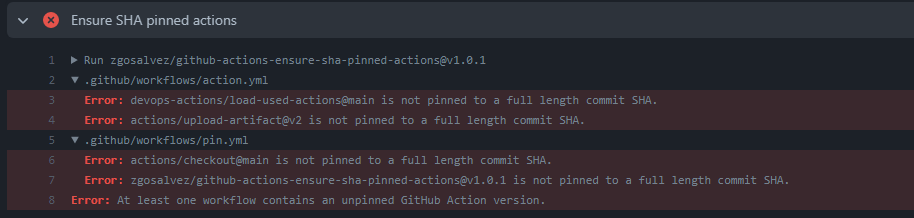
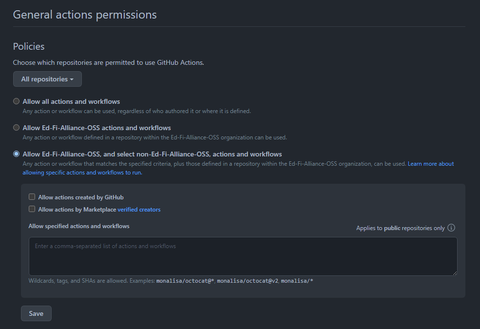
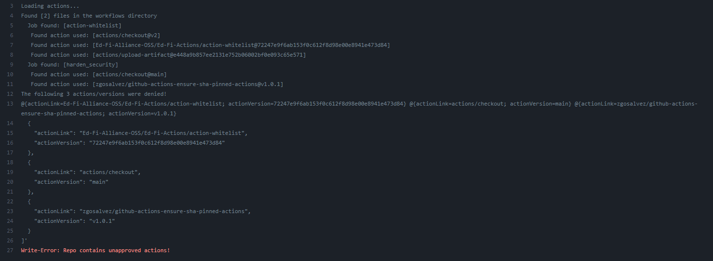
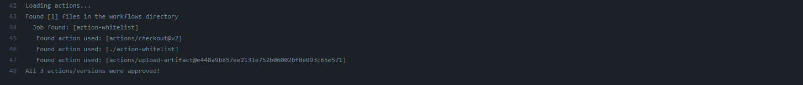

# Automated Security Scanning POC

[DEVOPS-76](https://tracker.ed-fi.org/browse/DEVOPS-76?src=confmacro)

This page will lay out information relating to the 3rd goal listed in
[Guidelines for Use of Github
Actions](../guidelines-for-use-of-github-actions.md):

- Provide an automated tool for monitoring GitHub Actions configurations in
  Ed-Fi code repositories.

This tool will:

1. Validate that all usage of Actions applies the commit hash technique rather
   than the tag version technique.
2. Compare the Actions used to a list of known-acceptable actions.
   1. Actions with namespace of "actions" are always accepted.
   2. Pre-approved actions, as determined by the Ed-Fi Tech Team, to be listed
      in a simple text file.
3. Print a text report describing any problems detected, and raise an
   appropriate error that will cause the build to fail.

Source Repository:
[Ed-Fi-Actions](https://github.com/Ed-Fi-Alliance-OSS/Ed-Fi-Actions)

### Initial Ideas

<details>
  <summary>Click here to expand...</summary>

### 1. Commit Hash Validation

- [pin-github-action](https://github.com/mheap/pin-github-action)
  [tool](https://michaelheap.com/improve-your-github-actions-security/)
- [ensure-sha-pinned-actions](https://github.com/zgosalvez/github-actions-ensure-sha-pinned-actions)
  [action](https://github.com/marketplace/actions/ensure-sha-pinned-actions) -
  [post](https://michaelheap.com/ensure-github-actions-pinned-sha/)
  - allowlist: The list of owners or repositories that will be ignored and will
    not throw an error.
    - "actions"
  - This action will throw an error if it finds GitHub Actions that are not
    pinned to full length commit SHAs.
    

### 2. Only allow known actions

Criteria:

- This action will throw an error if it finds GitHub Actions that are not on the
  list of approved authors.

Solutions:

- Github Action Policies:
  - You can disable all workflows for an organization [or set a policy that
    configures which actions can be used in an
    organization.](https://docs.github.com/en/organizations/managing-organization-settings/disabling-or-limiting-github-actions-for-your-organization#allowing-specific-actions-to-run)
  - 
  - **Allow actions created by GitHub:**
    - You can allow all actions created by GitHub to be used by workflows.
      Actions created by GitHub are located in the actions and github
      organizations.
  - **Allow Marketplace actions by verified creators:**
    - You can allow all GitHub Marketplace actions created by verified creators
      to be used by workflows. When GitHub has verified the creator of the
      action as a partner organization, the verified badge is displayed next to
      the action in GitHub Marketplace.
  - Further security options for Actions:
    - [https://docs.github.com/en/repositories/managing-your-repositorys-settings-and-features/enabling-features-for-your-repository/managing-github-actions-settings-for-a-repository](https://docs.github.com/en/repositories/managing-your-repositorys-settings-and-features/enabling-features-for-your-repository/managing-github-actions-settings-for-a-repository)
    - [https://docs.github.com/en/organizations/managing-organization-settings/disabling-or-limiting-github-actions-for-your-organization#configuring-required-approval-for-workflows-from-public-forks](https://docs.github.com/en/organizations/managing-organization-settings/disabling-or-limiting-github-actions-for-your-organization#configuring-required-approval-for-workflows-from-public-forks)
    - [https://docs.github.com/en/actions/security-guides/security-hardening-for-github-actions](https://docs.github.com/en/actions/security-guides/security-hardening-for-github-actions)
    - [https://securitylab.github.com/research/github-actions-preventing-pwn-requests/](https://securitylab.github.com/research/github-actions-preventing-pwn-requests/)

### 3. Text Report

Criteria:

- Action should print a text report describing any problems detected, and raise
  an appropriate error that will cause the build to fail

Solutions:

- For hashes,
  [ensure-sha-pinned-actions](https://github.com/zgosalvez/github-actions-ensure-sha-pinned-actions)
  will throw an error if it finds GitHub Actions that are not pinned to full
  length commit SHAs
- For unapproved authors, Github Action Policies should automatically fail the
  build if an action is not on the list
- The above solutions will fail the build if their criteria is not met, but will
  not print out a singular report.

</details>

## Implementation

The security scanning custom Github Action, action-whitelist, has been completed
on branch
[DEVOPS-79](https://github.com/Ed-Fi-Alliance-OSS/Ed-Fi-Actions/tree/DEVOPS-79).
Here's how it was implemented.

> _Documentation past this point will be within working directory
> **action-whitelist/**_

### Dependencies

The solution uses the powershell module
[powershell-yaml](https://github.com/cloudbase/powershell-yaml) to convert the
found yaml action files to Powershell objects we can work with. A git subtree
was created in the **_/dep/powershell-yaml/_** directory in order to include
this module in our code without needing to call Install-Module.

### Approved versions

The list of approved action authors and versions is located in
**approved.json.** It should be formatted as so:

```json
[
    {
      "actionLink": "actions/checkout",
      "actionVersion": "ec3a7ce113134d7a93b817d10a8272cb61118579"
    },
]
```

Where:

- actionLink - address to the action/author
- actionVersion - version or **commit hash** (preferably)

#### Custom Action

The custom action uses Powershell and Docker to accomplish our goal. Upon
running the action, a custom container is built using the **Dockerfile**, which:

- copies all powershell scripts and modules and the **approved.json** file to
  **/src/** directory of the container
- Runs **entrypoint.ps1**

The **entrypoint.ps1** executes a series of functions, sourced from the
**action-whitelist.psm1** module file.

These functions simply identify the workflow files in the repository running the
action, then finds actions used in those workflow files and checks them against
the **approved.json** file for validity.

If any actions are discovered that are not contained in the **approved.json**
file, the action will output the unapproved actions and fail.

### Example Outputs

❌ Actions found that are not in the approved.json file



✅ All actions detected are found within the approved.json file


