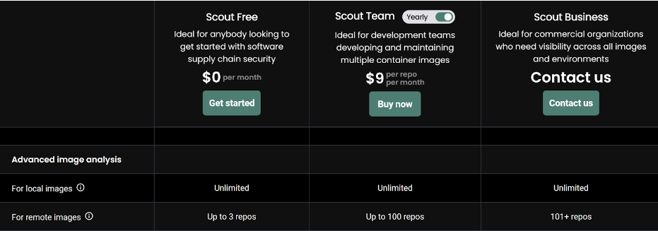

# Docker Scout Research

[Docker Scout](https://docs.docker.com/scout/) is a tool recently released by
Docker to analyze software vulnerabilities of Docker Images. See the [General
Availability announcement](https://www.youtube.com/watch?v=cYNE-ZUbH2o) for more
information

**Objective: Explore the tool, create a PoC and decide about the value added by
the tool into our overall security process.**

For this research, we want to answer the following questions:

1. How does it complement our existing security practices?
2. How do we take advantage of it for local builds / during active development?
3. What's the cost of using the tool?

## How does it complement out existing security practices?

a) Provides an option to generate an SBOM file for the Docker
images: [https://docs.docker.com/scout/sbom/](https://docs.docker.com/scout/sbom/)

This can be a new added value to the current process of generating SBOM files
for our software.

b) Generate a report of the vulnerabilities found in a Docker image, this can be
done from [Docker CLI](https://docs.docker.com/scout/local-fs/) and Docker
Desktop for free, as well as GitHub Actions and the Docker Scout Website
[https://docs.docker.com/scout/](https://docs.docker.com/scout/)

This adds value to an area where we are currently not getting report of
potential vulnerabilities, for example, this are the current warnings on the
[meadowlark
Dockerfile](https://hub.docker.com/r/edfialliance/meadowlark-ed-fi-api):


Docker Scout has a GitHub Action available to generate reports from images:

[https://docs.docker.com/scout/integrations/ci/gha/](https://docs.docker.com/scout/integrations/ci/gha/)

[https://github.com/docker/scout-action](https://github.com/docker/scout-action)

This action only reports the results, it does not create PR or automatically
fixes issues.

This can be integrated with GitHub code scanning to get results:

[https://github.com/docker/scout-action?tab=readme-ov-file#analyze-vulnerabilities-and-upload-report-to-github-code-scanning](https://github.com/docker/scout-action?tab=readme-ov-file#analyze-vulnerabilities-and-upload-report-to-github-code-scanning)

## How do we take advantage during active development?

We can take advantage of Docker Scout with the installed Docker Desktop to
periodically check for vulnerabilities ad hoc (currently free and included in
the installation).

If the GitHub Action is implemented, this can give warnings on PRs that could
help detect vulnerabilities.

## Cost

Pricing:
[https://docs.docker.com/subscription/scout-details/](https://docs.docker.com/subscription/scout-details/)




We can enable it right now for free with the 3 repositories included and add
more by demand.

## Alternatives

### Trivy

Open source security scanner, provides analysis for Docker Images, Git Repo,
Virtual Machine Images and Kubernetes to find security risks.
[https://trivy.dev/](https://trivy.dev/)

It has a [GitHub Action](https://github.com/aquasecurity/trivy-action) to run in
CI and a [VS Code
Plugin](https://github.com/aquasecurity/trivy-vscode-extension).

### Analyze Docker Image

```
trivy image edfialliance/ods-admin-api
```

Comparison between results with trivy and results with Docker Scout:

<details>
  <summary>Trivy Results</summary>

edfialliance/ods-admin-api:pre (alpine 3.17.3)  
 \==============================================  
 Total: 20 (UNKNOWN: 0, LOW: 0, MEDIUM: 18, HIGH: 2, CRITICAL: 0)

┌────────────┬───────────────┬──────────┬────────┬───────────────────┬───────────────┬──────────────────────────────────────────────────────────────┐  
 │ Library │ Vulnerability │ Severity │ Status │ Installed Version │ Fixed
Version │ Title │  
 ├────────────┼───────────────┼──────────┼────────┼───────────────────┼───────────────┼──────────────────────────────────────────────────────────────┤  
 │ libcrypto3 │ CVE-2023-5363 │ HIGH │ fixed │ 3.0.8-r3 │ 3.0.12-r0 │ openssl:
Incorrect cipher key and IV length processing │  
 │ │ │ │ │ │ │
[https://avd.aquasec.com/nvd/cve-2023-5363](https://avd.aquasec.com/nvd/cve-2023-5363)
│  
 │ ├───────────────┼──────────┤ │
├───────────────┼──────────────────────────────────────────────────────────────┤  
 │ │ CVE-2023-1255 │ MEDIUM │ │ │ 3.0.8-r4 │ openssl: Input buffer over-read in
AES-XTS implementation on │  
 │ │ │ │ │ │ │ 64 bit ARM │  
 │ │ │ │ │ │ │
[https://avd.aquasec.com/nvd/cve-2023-1255](https://avd.aquasec.com/nvd/cve-2023-1255)
│  
 │ ├───────────────┤ │ │
├───────────────┼──────────────────────────────────────────────────────────────┤  
 │ │ CVE-2023-2650 │ │ │ │ 3.0.9-r0 │ openssl: Possible DoS translating ASN.1
object identifiers │  
 │ │ │ │ │ │ │
[https://avd.aquasec.com/nvd/cve-2023-2650](https://avd.aquasec.com/nvd/cve-2023-2650)
│  
 │ ├───────────────┤ │ │
├───────────────┼──────────────────────────────────────────────────────────────┤  
 │ │ CVE-2023-2975 │ │ │ │ 3.0.9-r2 │ openssl: AES-SIV cipher implementation
contains a bug that │  
 │ │ │ │ │ │ │ causes it to ignore... │  
 │ │ │ │ │ │ │
[https://avd.aquasec.com/nvd/cve-2023-2975](https://avd.aquasec.com/nvd/cve-2023-2975)
│  
 │ ├───────────────┤ │ │
├───────────────┼──────────────────────────────────────────────────────────────┤  
 │ │ CVE-2023-3446 │ │ │ │ 3.0.9-r3 │ openssl: Excessive time spent checking DH
keys and │  
 │ │ │ │ │ │ │ parameters │  
 │ │ │ │ │ │ │
[https://avd.aquasec.com/nvd/cve-2023-3446](https://avd.aquasec.com/nvd/cve-2023-3446)
│  
 │ ├───────────────┤ │ │
├───────────────┼──────────────────────────────────────────────────────────────┤  
 │ │ CVE-2023-3817 │ │ │ │ 3.0.10-r0 │ OpenSSL: Excessive time spent checking DH
q parameter value │  
 │ │ │ │ │ │ │
[https://avd.aquasec.com/nvd/cve-2023-3817](https://avd.aquasec.com/nvd/cve-2023-3817)
│  
 │ ├───────────────┤ │ │
├───────────────┼──────────────────────────────────────────────────────────────┤  
 │ │ CVE-2023-5678 │ │ │ │ 3.0.12-r1 │ openssl: Generating excessively long
X9.42 DH keys or │  
 │ │ │ │ │ │ │ checking excessively long X9.42... │  
 │ │ │ │ │ │ │
[https://avd.aquasec.com/nvd/cve-2023-5678](https://avd.aquasec.com/nvd/cve-2023-5678)
│  
 │ ├───────────────┤ │ │
├───────────────┼──────────────────────────────────────────────────────────────┤  
 │ │ CVE-2023-6129 │ │ │ │ 3.0.12-r2 │ openssl: POLY1305 MAC implementation
corrupts vector │  
 │ │ │ │ │ │ │ registers on PowerPC │  
 │ │ │ │ │ │ │
[https://avd.aquasec.com/nvd/cve-2023-6129](https://avd.aquasec.com/nvd/cve-2023-6129)
│  
 │ ├───────────────┤ │ │
├───────────────┼──────────────────────────────────────────────────────────────┤  
 │ │ CVE-2023-6237 │ │ │ │ 3.0.12-r3 │ openssl: Excessive time spent checking
invalid RSA public │  
 │ │ │ │ │ │ │ keys │  
 │ │ │ │ │ │ │
[https://avd.aquasec.com/nvd/cve-2023-6237](https://avd.aquasec.com/nvd/cve-2023-6237)
│  
 │ ├───────────────┤ │ │
├───────────────┼──────────────────────────────────────────────────────────────┤  
 │ │ CVE-2024-0727 │ │ │ │ 3.0.12-r4 │ openssl: denial of service via null
dereference │  
 │ │ │ │ │ │ │
[https://avd.aquasec.com/nvd/cve-2024-0727](https://avd.aquasec.com/nvd/cve-2024-0727)
│  
 ├────────────┼───────────────┼──────────┤ │
├───────────────┼──────────────────────────────────────────────────────────────┤  
 │ libssl3 │ CVE-2023-5363 │ HIGH │ │ │ 3.0.12-r0 │ openssl: Incorrect cipher
key and IV length processing │  
 │ │ │ │ │ │ │
[https://avd.aquasec.com/nvd/cve-2023-5363](https://avd.aquasec.com/nvd/cve-2023-5363)
│  
 │ ├───────────────┼──────────┤ │
├───────────────┼──────────────────────────────────────────────────────────────┤  
 │ │ CVE-2023-1255 │ MEDIUM │ │ │ 3.0.8-r4 │ openssl: Input buffer over-read in
AES-XTS implementation on │  
 │ │ │ │ │ │ │ 64 bit ARM │  
 │ │ │ │ │ │ │
[https://avd.aquasec.com/nvd/cve-2023-1255](https://avd.aquasec.com/nvd/cve-2023-1255)
│  
 │ ├───────────────┤ │ │
├───────────────┼──────────────────────────────────────────────────────────────┤  
 │ │ CVE-2023-2650 │ │ │ │ 3.0.9-r0 │ openssl: Possible DoS translating ASN.1
object identifiers │  
 │ │ │ │ │ │ │
[https://avd.aquasec.com/nvd/cve-2023-2650](https://avd.aquasec.com/nvd/cve-2023-2650)
│  
 │ ├───────────────┤ │ │
├───────────────┼──────────────────────────────────────────────────────────────┤  
 │ │ CVE-2023-2975 │ │ │ │ 3.0.9-r2 │ openssl: AES-SIV cipher implementation
contains a bug that │  
 │ │ │ │ │ │ │ causes it to ignore... │  
 │ │ │ │ │ │ │
[https://avd.aquasec.com/nvd/cve-2023-2975](https://avd.aquasec.com/nvd/cve-2023-2975)
│  
 │ ├───────────────┤ │ │
├───────────────┼──────────────────────────────────────────────────────────────┤  
 │ │ CVE-2023-3446 │ │ │ │ 3.0.9-r3 │ openssl: Excessive time spent checking DH
keys and │  
 │ │ │ │ │ │ │ parameters │  
 │ │ │ │ │ │ │
[https://avd.aquasec.com/nvd/cve-2023-3446](https://avd.aquasec.com/nvd/cve-2023-3446)
│  
 │ ├───────────────┤ │ │
├───────────────┼──────────────────────────────────────────────────────────────┤  
 │ │ CVE-2023-3817 │ │ │ │ 3.0.10-r0 │ OpenSSL: Excessive time spent checking DH
q parameter value │  
 │ │ │ │ │ │ │
[https://avd.aquasec.com/nvd/cve-2023-3817](https://avd.aquasec.com/nvd/cve-2023-3817)
│  
 │ ├───────────────┤ │ │
├───────────────┼──────────────────────────────────────────────────────────────┤  
 │ │ CVE-2023-5678 │ │ │ │ 3.0.12-r1 │ openssl: Generating excessively long
X9.42 DH keys or │  
 │ │ │ │ │ │ │ checking excessively long X9.42... │  
 │ │ │ │ │ │ │
[https://avd.aquasec.com/nvd/cve-2023-5678](https://avd.aquasec.com/nvd/cve-2023-5678)
│  
 │ ├───────────────┤ │ │
├───────────────┼──────────────────────────────────────────────────────────────┤  
 │ │ CVE-2023-6129 │ │ │ │ 3.0.12-r2 │ openssl: POLY1305 MAC implementation
corrupts vector │  
 │ │ │ │ │ │ │ registers on PowerPC │  
 │ │ │ │ │ │ │
[https://avd.aquasec.com/nvd/cve-2023-6129](https://avd.aquasec.com/nvd/cve-2023-6129)
│  
 │ ├───────────────┤ │ │
├───────────────┼──────────────────────────────────────────────────────────────┤  
 │ │ CVE-2023-6237 │ │ │ │ 3.0.12-r3 │ openssl: Excessive time spent checking
invalid RSA public │  
 │ │ │ │ │ │ │ keys │  
 │ │ │ │ │ │ │
[https://avd.aquasec.com/nvd/cve-2023-6237](https://avd.aquasec.com/nvd/cve-2023-6237)
│  
 │ ├───────────────┤ │ │
├───────────────┼──────────────────────────────────────────────────────────────┤  
 │ │ CVE-2024-0727 │ │ │ │ 3.0.12-r4 │ openssl: denial of service via null
dereference │  
 │ │ │ │ │ │ │
[https://avd.aquasec.com/nvd/cve-2024-0727](https://avd.aquasec.com/nvd/cve-2024-0727)
│  
 └────────────┴───────────────┴──────────┴────────┴───────────────────┴───────────────┴──────────────────────────────────────────────────────────────┘

app/EdFi.Ods.AdminApi.deps.json (dotnet-core)  
 \=============================================  
 Total: 5 (UNKNOWN: 0, LOW: 0, MEDIUM: 4, HIGH: 1, CRITICAL: 0)

┌───────────────────────────────────────┬─────────────────────┬──────────┬────────┬───────────────────┬──────────────────────┬────────────────────────────────────────────────────────────┐  
 │ Library │ Vulnerability │ Severity │ Status │ Installed Version │ Fixed
Version │ Title │  
 ├───────────────────────────────────────┼─────────────────────┼──────────┼────────┼───────────────────┼──────────────────────┼────────────────────────────────────────────────────────────┤  
 │ Microsoft.IdentityModel.JsonWebTokens │ CVE-2024-21319 │ MEDIUM │ fixed │
6.25.1 │ 5.7.0, 6.34.0, 7.1.2 │ dotnet: .NET Denial of Service Vulnerability │  
 │ │ │ │ │ │ │
[https://avd.aquasec.com/nvd/cve-2024-21319](https://avd.aquasec.com/nvd/cve-2024-21319)
│  
 │ ├─────────────────────┤ │ │ │
├────────────────────────────────────────────────────────────┤  
 │ │ GHSA-59j7-ghrg-fj52 │ │ │ │ │ Microsoft Security Advisory CVE-2024-21319:
.NET Denial of │  
 │ │ │ │ │ │ │ Service Vulnerability │  
 │ │ │ │ │ │ │
[https://github.com/advisories/GHSA-59j7-ghrg-fj52](https://github.com/advisories/GHSA-59j7-ghrg-fj52)
│  
 ├───────────────────────────────────────┼─────────────────────┤ │
├───────────────────┤
├────────────────────────────────────────────────────────────┤  
 │ System.IdentityModel.Tokens.Jwt │ CVE-2024-21319 │ │ │ 6.24.0 │ │ dotnet:
.NET Denial of Service Vulnerability │  
 │ │ │ │ │ │ │
[https://avd.aquasec.com/nvd/cve-2024-21319](https://avd.aquasec.com/nvd/cve-2024-21319)
│  
 │ ├─────────────────────┤ │ │
├──────────────────────┼────────────────────────────────────────────────────────────┤  
 │ │ GHSA-59j7-ghrg-fj52 │ │ │ │ │ Microsoft Security Advisory CVE-2024-21319:
.NET Denial of │  
 │ │ │ │ │ │ │ Service Vulnerability │  
 │ │ │ │ │ │ │
[https://github.com/advisories/GHSA-59j7-ghrg-fj52](https://github.com/advisories/GHSA-59j7-ghrg-fj52)
│  
 ├───────────────────────────────────────┼─────────────────────┼──────────┤
├───────────────────┼──────────────────────┼────────────────────────────────────────────────────────────┤  
 │ System.Text.RegularExpressions │ CVE-2019-0820 │ HIGH │ │ 4.3.0 │ 4.3.1 │
dotnet: timeouts for regular expressions are not enforced │  
 │ │ │ │ │ │ │
[https://avd.aquasec.com/nvd/cve-2019-0820](https://avd.aquasec.com/nvd/cve-2019-0820)
│  
 └───────────────────────────────────────┴─────────────────────┴──────────┴────────┴───────────────────┴──────────────────────┴────────────────────────────────────────────────────────────┘

usr/share/dotnet/shared/Microsoft.AspNetCore.App/6.0.16/Microsoft.AspNetCore.App.deps.json
(dotnet-core)  
 \========================================================================================================  
 Total: 2 (UNKNOWN: 0, LOW: 0, MEDIUM: 0, HIGH: 1, CRITICAL: 1)

┌─────────────────────────────────────────────────┬────────────────┬──────────┬────────┬───────────────────┬───────────────────────┬─────────────────────────────────────────────────────┐  
 │ Library │ Vulnerability │ Severity │ Status │ Installed Version │ Fixed
Version │ Title │  
 ├─────────────────────────────────────────────────┼────────────────┼──────────┼────────┼───────────────────┼───────────────────────┼─────────────────────────────────────────────────────┤  
 │ Microsoft.AspNetCore.App.Runtime.linux-musl-x64 │ CVE-2024-21386 │ CRITICAL │
fixed │ 6.0.16 │ 6.0.27, 7.0.16, 8.0.2 │ dotnet: Denial of Service in SignalR
server │  
 │ │ │ │ │ │ │
[https://avd.aquasec.com/nvd/cve-2024-21386](https://avd.aquasec.com/nvd/cve-2024-21386)
│  
 │ ├────────────────┼──────────┤ │
├───────────────────────┼─────────────────────────────────────────────────────┤  
 │ │ CVE-2023-33170 │ HIGH │ │ │ 7.0.9, 6.0.20 │ dotnet: race condition in Core
SignInManager │  
 │ │ │ │ │ │ │ PasswordSignInAsync method │  
 │ │ │ │ │ │ │
[https://avd.aquasec.com/nvd/cve-2023-33170](https://avd.aquasec.com/nvd/cve-2023-33170)
│  
 └─────────────────────────────────────────────────┴────────────────┴──────────┴────────┴───────────────────┴───────────────────────┴─────────────────────────────────────────────────────┘

usr/share/dotnet/shared/Microsoft.NETCore.App/6.0.16/Microsoft.NETCore.App.deps.json
(dotnet-core)  
 \==================================================================================================  
 Total: 1 (UNKNOWN: 0, LOW: 0, MEDIUM: 1, HIGH: 0, CRITICAL: 0)

┌──────────────────────────────────────────────┬────────────────┬──────────┬────────┬───────────────────┬────────────────┬──────────────────────────────────────────────────────────┐  
 │ Library │ Vulnerability │ Severity │ Status │ Installed Version │ Fixed
Version │ Title │  
 ├──────────────────────────────────────────────┼────────────────┼──────────┼────────┼───────────────────┼────────────────┼──────────────────────────────────────────────────────────┤  
 │ Microsoft.NETCore.App.Runtime.linux-musl-x64 │ CVE-2023-36799 │ MEDIUM │
fixed │ 6.0.16 │ 7.0.11, 6.0.22 │ dotnet: Denial of Service with Client
Certificates using │  
 │ │ │ │ │ │ │ .NET Kestrel │  
 │ │ │ │ │ │ │
[https://avd.aquasec.com/nvd/cve-2023-36799](https://avd.aquasec.com/nvd/cve-2023-36799)
│  
 └──────────────────────────────────────────────┴────────────────┴──────────┴────────┴───────────────────┴────────────────┴──────────────────────────────────────────────────────────┘

</details>

<br/>

<details>
  <summary>Docker Scout Results</summary>

## Overview

│ Analyzed Image
────────────────────┼─────────────────────────────────────────────────────  
 Target │ edfialliance/ods-admin-api:pre digest │ 064e9e6df77d platform │
linux/amd64 provenance │
[https://github.com/Ed-Fi-Alliance-OSS/AdminAPI-2.0](https://github.com/Ed-Fi-Alliance-OSS/AdminAPI-2.0)
│
[https://github.com/Ed-Fi-Alliance-OSS/AdminAPI-2.0/blob/b6f47fb13111b7f1fbb5d3f52a4ea015d0fb7f05](https://github.com/Ed-Fi-Alliance-OSS/AdminAPI-2.0/blob/b6f47fb13111b7f1fbb5d3f52a4ea015d0fb7f05)
vulnerabilities │ 0C 2H 16M 0L 1? size │ 74 MB packages │ 651

## Packages and Vulnerabilities

0C 1H 8M 0L 1? openssl 3.0.8-r3  
 pkg:apk/alpine/openssl@3.0.8-r3?os_name=alpine&os_version=3.17

x HIGH CVE-2023-5363  
 [https://scout.docker.com/v/CVE-2023-5363?s=alpine&n=openssl&ns=alpine&t=apk&osn=alpine&osv=3.17&vr=](https://scout.docker.com/v/CVE-2023-5363?s=alpine&n=openssl&ns=alpine&t=apk&osn=alpine&osv=3.17&vr=%3C3.0.12-r0)  
 Affected range : < 3.0.12-r0 Fixed version : 3.0.12-r0

x MEDIUM CVE-2023-6129  
 [https://scout.docker.com/v/CVE-2023-6129?s=alpine&n=openssl&ns=alpine&t=apk&osn=alpine&osv=3.17&vr=](https://scout.docker.com/v/CVE-2023-6129?s=alpine&n=openssl&ns=alpine&t=apk&osn=alpine&osv=3.17&vr=%3C3.0.12-r2)  
 Affected range : < 3.0.12-r2 Fixed version : 3.0.12-r2

x MEDIUM CVE-2023-2650  
 [https://scout.docker.com/v/CVE-2023-2650?s=alpine&n=openssl&ns=alpine&t=apk&osn=alpine&osv=3.17&vr=](https://scout.docker.com/v/CVE-2023-2650?s=alpine&n=openssl&ns=alpine&t=apk&osn=alpine&osv=3.17&vr=%3C3.0.9-r0)  
 Affected range : < 3.0.9-r0 Fixed version : 3.0.9-r0

x MEDIUM CVE-2023-1255  
 [https://scout.docker.com/v/CVE-2023-1255?s=alpine&n=openssl&ns=alpine&t=apk&osn=alpine&osv=3.17&vr=](https://scout.docker.com/v/CVE-2023-1255?s=alpine&n=openssl&ns=alpine&t=apk&osn=alpine&osv=3.17&vr=%3C3.0.8-r4)  
 Affected range : < 3.0.8-r4 Fixed version : 3.0.8-r4

x MEDIUM CVE-2024-0727  
 [https://scout.docker.com/v/CVE-2024-0727?s=alpine&n=openssl&ns=alpine&t=apk&osn=alpine&osv=3.17&vr=](https://scout.docker.com/v/CVE-2024-0727?s=alpine&n=openssl&ns=alpine&t=apk&osn=alpine&osv=3.17&vr=%3C3.0.12-r4)  
 Affected range : < 3.0.12-r4 Fixed version : 3.0.12-r4

x MEDIUM CVE-2023-5678  
 [https://scout.docker.com/v/CVE-2023-5678?s=alpine&n=openssl&ns=alpine&t=apk&osn=alpine&osv=3.17&vr=](https://scout.docker.com/v/CVE-2023-5678?s=alpine&n=openssl&ns=alpine&t=apk&osn=alpine&osv=3.17&vr=%3C3.0.12-r1)  
Affected range : < 3.0.12-r1 Fixed version : 3.0.12-r1

x MEDIUM CVE-2023-3817  
 [https://scout.docker.com/v/CVE-2023-3817?s=alpine&n=openssl&ns=alpine&t=apk&osn=alpine&osv=3.17&vr=](https://scout.docker.com/v/CVE-2023-3817?s=alpine&n=openssl&ns=alpine&t=apk&osn=alpine&osv=3.17&vr=%3C3.0.10-r0)  
 Affected range : < 3.0.10-r0 Fixed version : 3.0.10-r0

x MEDIUM CVE-2023-3446  
 [https://scout.docker.com/v/CVE-2023-3446?s=alpine&n=openssl&ns=alpine&t=apk&osn=alpine&osv=3.17&vr=](https://scout.docker.com/v/CVE-2023-3446?s=alpine&n=openssl&ns=alpine&t=apk&osn=alpine&osv=3.17&vr=%3C3.0.9-r3)  
 Affected range : < 3.0.9-r3 Fixed version : 3.0.9-r3

x MEDIUM CVE-2023-2975  
 [https://scout.docker.com/v/CVE-2023-2975?s=alpine&n=openssl&ns=alpine&t=apk&osn=alpine&osv=3.17&vr=](https://scout.docker.com/v/CVE-2023-2975?s=alpine&n=openssl&ns=alpine&t=apk&osn=alpine&osv=3.17&vr=%3C3.0.9-r2)  
 Affected range : < 3.0.9-r2 Fixed version : 3.0.9-r2

x UNSPECIFIED CVE-2023-6237  
 [https://scout.docker.com/v/CVE-2023-6237?s=alpine&n=openssl&ns=alpine&t=apk&osn=alpine&osv=3.17&vr=](https://scout.docker.com/v/CVE-2023-6237?s=alpine&n=openssl&ns=alpine&t=apk&osn=alpine&osv=3.17&vr=%3C3.0.12-r3)  
 Affected range : < 3.0.12-r3 Fixed version : 3.0.12-r3

0C 1H 0M 0L System.Text.RegularExpressions 4.3.0  
 pkg:nuget/System.Text.RegularExpressions@4.3.0

x HIGH CVE-2019-0820 [Inefficient Regular Expression Complexity]  
 [https://scout.docker.com/v/CVE-2019-0820?s=github&n=System.Text.RegularExpressions&t=nuget&vr=](https://scout.docker.com/v/CVE-2019-0820?s=github&n=System.Text.RegularExpressions&t=nuget&vr=%3E%3D4.3.0%2C%3C4.3.1)  
 Affected range : >=4.3.0 : < 4.3.1 Fixed version : 4.3.1 CVSS Score : 7.5 CVSS
Vector : CVSS:3.1/AV:N/AC:L/PR:N/UI:N/S:U/C:N/I:N/A:H

0C 0H 2M 0L Microsoft.IdentityModel.JsonWebTokens
6.25.1.31130213719.9ddad8fc51ed2732622323612acad83f6629d5ba  
 pkg:nuget/Microsoft.IdentityModel.JsonWebTokens@6.25.1.31130213719.9ddad8fc51ed2732622323612acad83f6629d5ba

x MEDIUM GHSA-59j7-ghrg-fj52  
 [https://scout.docker.com/v/GHSA-59j7-ghrg-fj52?s=github&n=Microsoft.IdentityModel.JsonWebTokens&t=nuget&vr=](https://scout.docker.com/v/GHSA-59j7-ghrg-fj52?s=github&n=Microsoft.IdentityModel.JsonWebTokens&t=nuget&vr=%3E%3D6.5.0%2C%3C6.34.0)  
 Affected range : > =6.5.0 : < 6.34.0 Fixed version : 6.34.0 CVSS Score : 6.8 CVSS
Vector : CVSS:3.1/AV:N/AC:L/PR:H/UI:N/S:C/C:N/I:N/A:H

x MEDIUM CVE-2024-21319  
 [https://scout.docker.com/v/CVE-2024-21319?s=github&n=Microsoft.IdentityModel.JsonWebTokens&t=nuget&vr=](https://scout.docker.com/v/CVE-2024-21319?s=github&n=Microsoft.IdentityModel.JsonWebTokens&t=nuget&vr=%3E%3D6.5.0%2C%3C6.34.0)  
 Affected range : >=6.5.0 : < 6.34.0 Fixed version : 6.34.0 CVSS Score : 6.8 CVSS
Vector : CVSS:3.1/AV:N/AC:L/PR:H/UI:N/S:C/C:N/I:N/A:H

0C 0H 2M 0L System.IdentityModel.Tokens.Jwt
6.24.0.31013185938.779de3802c12c2b5331424e6079e76b06183757a  
 pkg:nuget/System.IdentityModel.Tokens.Jwt@6.24.0.31013185938.779de3802c12c2b5331424e6079e76b06183757a

x MEDIUM GHSA-59j7-ghrg-fj52  
 [https://scout.docker.com/v/GHSA-59j7-ghrg-fj52?s=github&n=System.IdentityModel.Tokens.Jwt&t=nuget&vr=](https://scout.docker.com/v/GHSA-59j7-ghrg-fj52?s=github&n=System.IdentityModel.Tokens.Jwt&t=nuget&vr=%3E%3D6.5.0%2C%3C6.34.0)  
 Affected range : >=6.5.0 : < 6.34.0 Fixed version : 6.34.0 CVSS Score : 6.8 CVSS
Vector : CVSS:3.1/AV:N/AC:L/PR:H/UI:N/S:C/C:N/I:N/A:H

x MEDIUM CVE-2024-21319  
 [https://scout.docker.com/v/CVE-2024-21319?s=github&n=System.IdentityModel.Tokens.Jwt&t=nuget&vr=](https://scout.docker.com/v/CVE-2024-21319?s=github&n=System.IdentityModel.Tokens.Jwt&t=nuget&vr=%3E%3D6.5.0%2C%3C6.34.0)  
 Affected range : >=6.5.0 : < .34.0 Fixed version : 6.34.0 CVSS Score : 6.8 CVSS
Vector : CVSS:3.1/AV:N/AC:L/PR:H/UI:N/S:C/C:N/I:N/A:H

0C 0H 2M 0L Microsoft.IdentityModel.JsonWebTokens 6.25.1  
 pkg:nuget/Microsoft.IdentityModel.JsonWebTokens@6.25.1

x MEDIUM GHSA-59j7-ghrg-fj52  
 [https://scout.docker.com/v/GHSA-59j7-ghrg-fj52?s=github&n=Microsoft.IdentityModel.JsonWebTokens&t=nuget&vr=](https://scout.docker.com/v/GHSA-59j7-ghrg-fj52?s=github&n=Microsoft.IdentityModel.JsonWebTokens&t=nuget&vr=%3E%3D6.5.0%2C%3C6.34.0)  
 Affected range : >=6.5.0 : < 6.34.0 Fixed version : 6.34.0 CVSS Score : 6.8 CVSS
Vector : CVSS:3.1/AV:N/AC:L/PR:H/UI:N/S:C/C:N/I:N/A:H

x MEDIUM CVE-2024-21319  
 [https://scout.docker.com/v/CVE-2024-21319?s=github&n=Microsoft.IdentityModel.JsonWebTokens&t=nuget&vr=](https://scout.docker.com/v/CVE-2024-21319?s=github&n=Microsoft.IdentityModel.JsonWebTokens&t=nuget&vr=%3E%3D6.5.0%2C%3C6.34.0)  
 Affected range : >=6.5.0 : < 6.34.0 Fixed version : 6.34.0 CVSS Score : 6.8 CVSS
Vector : CVSS:3.1/AV:N/AC:L/PR:H/UI:N/S:C/C:N/I:N/A:H

0C 0H 2M 0L System.IdentityModel.Tokens.Jwt 6.24.0  
 pkg:nuget/System.IdentityModel.Tokens.Jwt@6.24.0

x MEDIUM GHSA-59j7-ghrg-fj52  
 [https://scout.docker.com/v/GHSA-59j7-ghrg-fj52?s=github&n=System.IdentityModel.Tokens.Jwt&t=nuget&vr=](https://scout.docker.com/v/GHSA-59j7-ghrg-fj52?s=github&n=System.IdentityModel.Tokens.Jwt&t=nuget&vr=%3E%3D6.5.0%2C%3C6.34.0)  
 Affected range : >=6.5.0 : < 6.34.0 Fixed version : 6.34.0 CVSS Score : 6.8 CVSS
Vector : CVSS:3.1/AV:N/AC:L/PR:H/UI:N/S:C/C:N/I:N/A:H

x MEDIUM CVE-2024-21319  
 [https://scout.docker.com/v/CVE-2024-21319?s=github&n=System.IdentityModel.Tokens.Jwt&t=nuget&vr=](https://scout.docker.com/v/CVE-2024-21319?s=github&n=System.IdentityModel.Tokens.Jwt&t=nuget&vr=%3E%3D6.5.0%2C%3C6.34.0)  
 Affected range : >=6.5.0 : < 6.34.0 Fixed version : 6.34.0 CVSS Score : 6.8 CVSS
Vector : CVSS:3.1/AV:N/AC:L/PR:H/UI:N/S:C/C:N/I:N/A:H

19 vulnerabilities found in 6 packages  
 UNSPECIFIED 1 LOW 0 MEDIUM 16 HIGH 2 CRITICAL 0

What's Next?  
 View base image update recommendations → docker scout recommendations
edfialliance/ods-admin-api:pre

</details>
<br/>

After analyzing both results, this shows that most of the vulnerabilities are
reported by both tools, therefore, using both is redundant since we will have
reports for the same errors.

Trivy adds some additional scanning that it's worth considering, and a simpler
explanation of the results.
