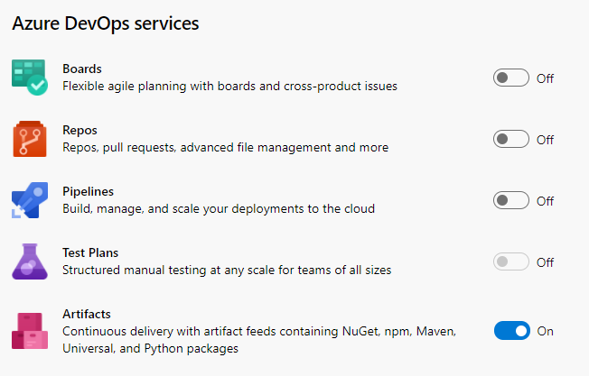
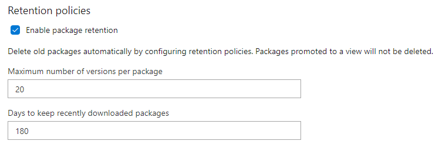

# Azure Artifacts Setup

## Organization-level Settings

[https://dev.azure.com/ed-fi-alliance/](https://dev.azure.com/ed-fi-alliance/)

## User Management

[https://dev.azure.com/ed-fi-alliance/_settings/users](https://dev.azure.com/ed-fi-alliance/_settings/users)

Can add users who are created in ~Active Directory~ Entra, on Azure
subscription `chrismoffattedfi`, or can add Visual Studio subscribers, or
[Stakeholders](https://docs.microsoft.com/en-us/azure/devops/organizations/security/get-started-stakeholder?view=azure-devops&tabs=agile-process).
Stakeholders can have full access to Azure Artifacts, so this *should* be a way
to add development contractors if needed (e.g. for promoting a package to the
Release view).

::: warning

Once a user is granted administrative access, there is no obvious way to revoke it.

:::

## Ed-Fi-Alliance-OSS Project

The Artifacts are under [project
Ed-Fi-Alliance-OSS](https://dev.azure.com/ed-fi-alliance/Ed-Fi-Alliance-OSS)
([project
settings](https://dev.azure.com/ed-fi-alliance/Ed-Fi-Alliance-OSS/_settings/)).

## Enabled Services

Should not change these services without discussion.



## Package Feed URLs

- [NuGet](https://pkgs.dev.azure.com/ed-fi-alliance/Ed-Fi-Alliance-OSS/_packaging/EdFi/nuget/v3/index.json)
- [NPM](https://pkgs.dev.azure.com/ed-fi-alliance/Ed-Fi-Alliance-OSS/_packaging/EdFi/npm/registry/)
- [PIP](https://pkgs.dev.azure.com/ed-fi-alliance/Ed-Fi-Alliance-OSS/_packaging/EdFi/pypi/simple/)

## Retention Policies



## Operations

### Automation Goals

1. Publish pre-release and/or release packages to Azure Artifacts
2. Promote a version to a "release", thus preventing it from being purged

## Pushing a Package to the Feed

Publishing / pushing a package to Azure Artifacts requires authentication. The
authentication mechanism is different than the one built into nuget.exe.
NuGet.exe requires that API key be provided at the command line; however, Azure
Artifacts will ignore the value. Thus any random value will do the trick. Use
the [Azure Artifacts Credential
Provider](https://github.com/microsoft/artifacts-credprovider) to acquire a
token.

## Promoting a Package to Release View

This has the effect of "pinning" the package so that it will not be purged
through the retention policy.

Documentation on the packagesBatch API endpoint used below: [NuGet - Update
Package
Versions](https://docs.microsoft.com/en-us/rest/api/azure/devops/artifactspackagetypes/nuget/update%20package%20versions?view=azure-devops-rest-5.0).

```pwsh
$user = "%azureArtifacts.edFiBuildAgent.userName%"
$pass = ConvertTo-SecureString -String "%azureArtifacts.edFiBuildAgent.accessToken%" -AsPlainText -Force
$credential = New-Object -TypeName System.Management.Automation.PSCredential -ArgumentList $user, $pass
$body = @{
    data = @{
        viewId = "Release"
    }
    operation = 0
    packages = @(
        @{
            id = "%nuget.package.name%"
            version = "%nuget.package.version%"
            protocolType = "NuGet"
        }
    )
}

$parameters = @{
    Method = "POST"
    ContentType = "application/json"
    Credential = $credential
    URI = "%azureArtifacts.api.packaging%/nuget/packagesBatch?api-version=5.0-preview.1"
    Body = ConvertTo-Json $body
}
Write-Host @parameters
Invoke-RestMethod @parameters
```

## Manual Package Publishing

### NuGet.exe

Pushing manually requires a Username and Personal Access Token (PAT). To create
your own see Microsoft's docs: [Create a
PAT](https://docs.microsoft.com/en-us/azure/devops/organizations/accounts/use-personal-access-tokens-to-authenticate?view=azure-devops&tabs=preview-page#create-a-pat).

#### Add a Source

```shell
nuget sources add -name EdFiAzure -source https://pkgs.dev.azure.com/ed-fi-alliance/Ed-Fi-Alliance-OSS/_packaging/EdFi/nuget/v3/index.json -username <UserName> -password <Pat>
```

::: warning

If the source is already registered you can remove a source by name.

:::

#### List Sources

```shell
nuget sources
```

#### **Remove a Source**

```shell
nuget sources remove -name <SourceName>
```

#### Push a Package

```shell
nuget push -source https://pkgs.dev.azure.com/ed-fi-alliance/Ed-Fi-Alliance-OSS/_packaging/EdFi/nuget/v3/index.json -apikey <PAT> .\SomePackage.nupkg
```

For more information see Microsoft's docs: [Create and publish your own NuGet
package](https://docs.microsoft.com/en-us/azure/devops/artifacts/nuget/publish?view=azure-devops#create-and-publish-your-own-nuget-package).

### Dotnet.exe

Use one of these options:

1. Install the
   [artifacts-credprovider](https://github.com/Microsoft/artifacts-credprovider/blob/master/README.md).
2. In PowerShell, setup an environment variable like so:

   ```shell
   $env:VSS_NUGET_EXTERNAL_FEED_ENDPOINTS = '{"endpointCredentials": [{"endpoint":"https://pkgs.dev.azure.com/ed-fi-alliance/Ed-Fi-Alliance-OSS/_packaging/EdFi/nuget/v3/index.json", "password":"your personal access token here"}]}'
   ```

3. Push the package

   ```shell
    dotnet nuget push -s https://pkgs.dev.azure.com/ed-fi-alliance/Ed-Fi-Alliance-OSS/_packaging/EdFi/nuget/v3/index.json .\EdFi.Suite3.Db.Deploy.2.0.0.nupkg --api-key az
   ```
