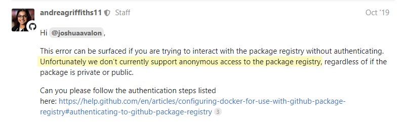
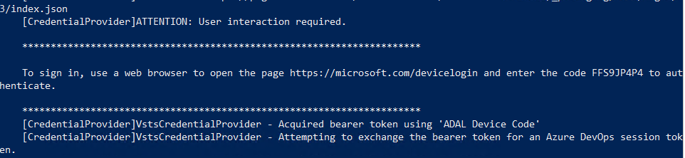
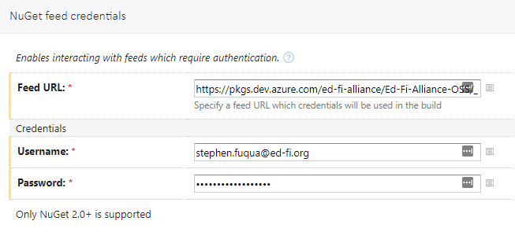
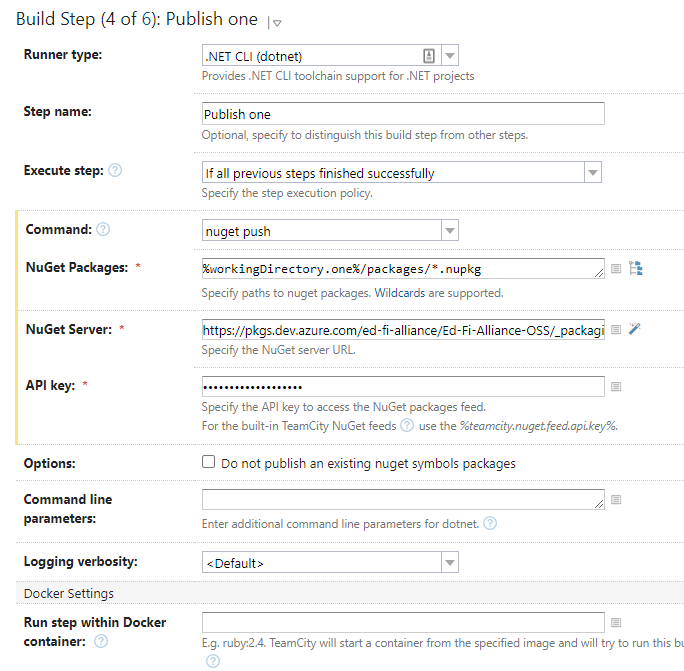
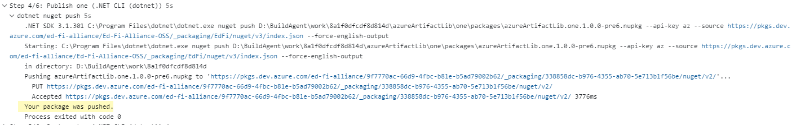
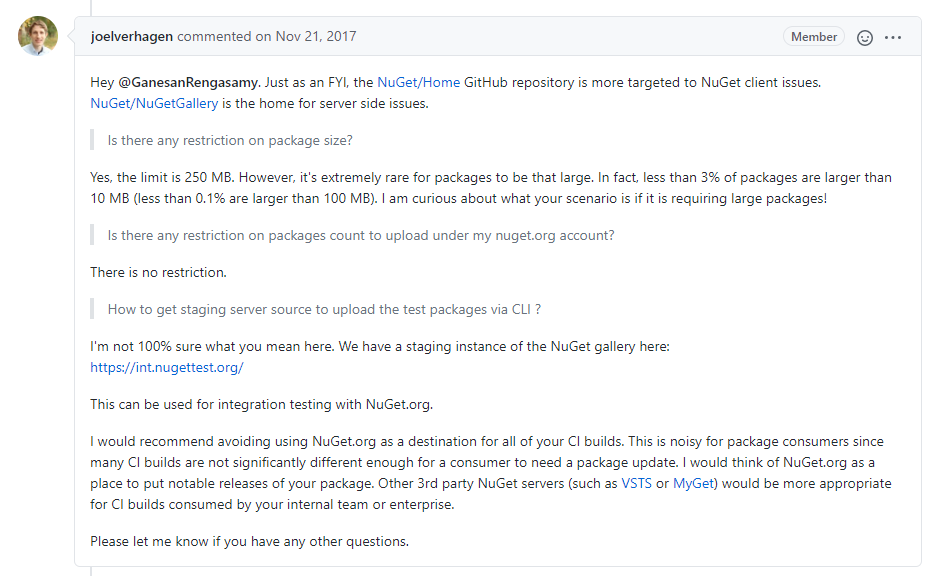
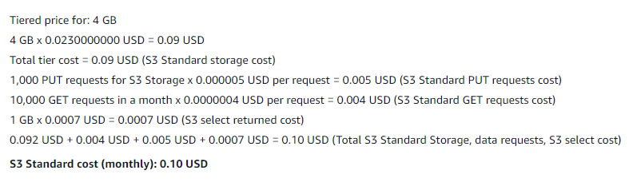

# Background Research Notes for File Distribution

## Current State

The Ed-Fi Alliance distributes compiled code and/or databases through several
mechanisms:

- NuGet and JavaScript (npm) packages through MyGet.org, including
  - All .NET shared libraries
  - PowerShell shared libraries and installers
  - ODS/API applications
    - Web API
    - Sandbox
    - Swagger UI
    - Code Generation
    - Key Retrieval (historical)
    - Security Configuration (historical)
  - ODS Admin App, both as a raw package and as an installer
  - Template databases for SQL Server and PostgreSQL
  - MetaEd plugins and packages.
- Stand-alone executables through GitHub releases, including
  - Analytics Middle Tier
  - Sample Data Generator
  - Data Import.
- Stand-alone executables through Confluence, including
  - ODS/API project template (VSIX)
  - ODS Admin App
  - MetaEd.
- Block storage in both AWS and Azure.
  - Cloud ODS
  - Sample databases.

### Problems

1. Proliferation of solutions - where to put new application; there is some
   duplication; not all tools as readily used with build automation.
2. MyGet quota restrictions - only 4 GB of storage, and we're constantly
   running at 80-90% of quota; manual efforts are taken to keep below 90%.
3. Cost optimization - everything in AWS and Azure is in the standard storage
   tier, regardless of frequency of access.

### Requirements

1. Distribution for these file types

   1. NuGet package (\*.nupkg)
   2. Node packages (npm)
   3. Executables (\*.exe)
   4. Windows Installers (\*.exe or \*.msi)
   5. Compressed files (e.g. databases) (\*.zip or \*.7z)
   6. Docker images
      (⚠️

      future)

2. Avoid large-file distribution through Confluence.
3. Closed source application binaries (MetaEd, DataImport) should not be
   readily discoverable, although they do not have to require strict
   authorization.
4. Choose the right tool for the job: multiple tools can be acceptable, they
   just need to be justified rather than ad-hoc.

# Potential Solutions

## MyGet

### Features

| Feature          | Support | Notes                               |
| ---------------- | ------- | ----------------------------------- |
| ​NuGet           | ✅​      | ​                                   |
| npm              | ✅       |                                     |
| vsix             | ✅       | not currently used                  |
| Docker           | ❌       | not currently used                  |
| Python           | ✅       | not currently used                  |
| Upstream Sources | ✅       | Can proxy with or without mirroring |
| Retention rules  | ✅       |                                     |

### Cost

Currently have a "Professional - Legacy" plan with one public feed, five private
feeds, and four GB storage, for $25.00 per month plus tax ($300 _per annum_).

This same plan is now $1,395 *per annum*. MyGet does not advertise the
additional cost for expanded storage quota. A quote was not requested because of
the substantial increase in cost to get back to the same quota as we have today.

## GitHub

UNACCEPTABLE

### Features

| Feature          | Support | Notes                                                                    |
| ---------------- | ------- | ------------------------------------------------------------------------ |
| ​NuGet           | ✅​      |                                                                          |
| npm              | ✅       |                                                                          |
| vsix             | ❌       | (not currently used)                                                     |
| Docker           | ✅       | (not currently used)                                                     |
| Python           | ❌       | (not currently used)                                                     |
| Upstream Sources | ❌       |                                                                          |
| Retention rules  | ❌       | This is a significant limitation for management of pre-release packages. |

### Cost

Free for public packages, with max storage of 500 MB and 1 GB data transfer
(out) per month. Overages are charted at $0.25 per GB of storage and $0.50 per
GB of data transfer.

:::warning

GitHub Packages is not available in the legacy "Ed-Fi-Alliance"
organization because it is on a legacy billing plan.

:::

### Misc Notes

Only authenticated users can download packages. That's terrible for an open
source project. Screenshot below is in a Docker thread, but I've seen the same
comment in a Maven message thread and experienced it with NuGet first-hand.



### Proof-of-Concept

The documentation instructs you to use the `dotnet nuget push`  command​. This
does not work! The command tells you that an API key is needed, which is not
mentioned by the documentation. There is an [open community support
issue](https://github.community/t/github-package-registry-not-compatible-with-dotnet-nuget-client/14392)
about this, but no urgency to fix this. Rather startling in fact. Alternative:
third-party [gpr tool](https://github.com/jcansdale/gpr) (GitHub Package
Repository).

Even with the gpr tool I did not have success. Was finally able to push a
package using the `curl.exe` provided with Git.

<details>
<summary><b>Curl example...</b></summary>

```
$curl="C:\Program Files\Git\mingw64\bin\curl.exe"
$params=@(
  "-vX", "PUT",
  "-u", "stephenfuqua:$env:GH_ACCESS_TOKEN",
  "-F", "package=@.\bin\debug\ghArtifactLib.one.1.0.0.nupkg",
  "https://nuget.pkg.github.com/Ed-Fi-Alliance-OSS/"
)
&$curl $params
```

</details>

## Azure Artifacts

ACCEPTABLE

### Features

| Feature          | Support                                                              | Notes                                                                                                                                                                          |
| ---------------- | -------------------------------------------------------------------- | ------------------------------------------------------------------------------------------------------------------------------------------------------------------------------ |
| ​NuGet           | ✅​                                                                   | ​                                                                                                                                                                              |
| npm              | ✅                                                                    |                                                                                                                                                                                |
| vsix             | ✅                                                                    | not currently used                                                                                                                                                             |
| Docker           | ❌                                                                    | not currently used                                                                                                                                                             |
| Python           | ✅                                                                    | not currently used                                                                                                                                                             |
| Upstream Sources | ⚠️ | Only for authenticated users                                                                                                                                                   |
| Retention rules  | ✅                                                                    | Can set max # versions per package and days to keep "recently" downloaded packages.<br/>⚠️ what is "recent"? |

### Cost

4 GB would be $2 / month with no transfer costs. Additional $2/GB up to 10 GB,
then $1/GB.

### Misc Notes

- Need more info on retention policies.
- Organization-scoped feeds can have upstream sources, but cannot be used
  without credentials. Project-scoped feeds can be public, but don't have
  upstream sources.
- Looks like a viable alternative to MyGet for private hosting.

### Proof-of-Concept

- Created an Azure DevOps
  organization: [https://dev.azure.com/ed-fi-alliance](https://dev.azure.com/ed-fi-alliance)
  - [Instructions for Changing
    Ownership](https://docs.microsoft.com/en-us/azure/devops/organizations/accounts/change-organization-ownership?view=azure-devops)
- Authentication - three options

  - ⚠️
    Use Microsoft's nuget plugin Credential Provider - works for
     individuals, but did not work as expected on a TeamCity build.

  - ❌
    Integrate a [NuGet
     package](https://docs.microsoft.com/en-us/azure/devops/pipelines/packages/jenkins?view=azure-devops)
     into the application - do not want to "pollute" an open source
     application with this.

  - ✅
    Use TeamCity's nuget plugin Credential Provider - applies only to our
     build configurations, separate from source code, so this is acceptable
     and it worked.

- ⚠️
  Success using the Microsoft credential provider on a TeanCity build agent
   server. *But this did not work from the automated build.*

  - RDP as edfi-srvc-teamcity
  - Download the powershell setup tool and run it
  - open Chrome and
    visit [https://login.microsoftonline.com](https://login.microsoftonline.com)
  - Sign-in
    as [EdFiBuildAgent@chrismoffattedfi.onmicrosoft.com](mailto:EdFiBuildAgent@chrismoffattedfi.onmicrosoft.com)
  - Credentials are in Password Manager Pro
  - Prepare credentials using a small POC project (any project withe NuGet
    packages could be used; this one has a nuget.config already setup).

    ```
    cd ~/Desktop
    git clone https://github.com/Ed-Fi-Alliance/ed-fi-gist
    cd ed-fi-gist
    git checkout azure-artifacts-poc
    cd two
    git restore --interactive
    ```

  - This gives you a link to open in Chrome. The page will tell you to enter
    a code from your device. That code is there in the PowerShell console
    output. Enter the code and follow instructions  
    
  - Next, test out nuget push. The following command should get a
    409-conflict because there is already a package with version 1.0.0.
    That's fine - it still proves that the connectivity has been setup
    correctly.

    ```
    cd ../one
    dotnet build
    dotnet pack
    dotnet nuget push --source EdFi --api-key az .\bin\debug\azureArtifactLib.one.1.0.0.nupkg
    ```

  - ✅
    On TeamCity

    - [https://intedfitools1.msdf.org/buildConfiguration/Experimental_AzureArtifactsPoc/75627?buildTab=log&focusLine=3&linesState=137.138](https://intedfitools1.msdf.org/buildConfiguration/Experimental_AzureArtifactsPoc/75627?buildTab=log&focusLine=3&linesState=137.138)
    - Configure the NuGet Credentials feature. Get a personal access token
      for the EdFi Build Agent account instead of using Stephen's token.
      This eliminates the need to install that PowerShell script   
      
    - The API key is meaningless. In the example below it is just "az"  
      
    - Success  
      

## [Nuget.org](http://Nuget.org)

ACCEPTABLE

### Features

| Feature          | Support | Notes |
| ---------------- | ------- | ----- |
| ​NuGet           | ✅​      | ​Free |
| npm              | ❌       |       |
| vsix             | ❌       |       |
| Docker           | ❌       |       |
| Python           | ❌       |       |
| Upstream Sources | ❌       |       |
| Retention rules  | ❌       |       |

### Cost

Free

### Misc Notes

- Appropriate for Apache-licensed libraries
- [Creating organizational
  accounts](https://docs.microsoft.com/en-us/nuget/nuget-org/organizations-on-nuget-org)
- Notes from a GitHub issues response about file size limits:  
  
- There is an integration
  environment: [https://int.nugettest.org/](https://int.nugettest.org/)
- Useful for public releases and some pre-releases. Not sure that it is good
  for everything we do as NuGet packages though, especially in terms of file
  size, although officially it looks like they're not limiting us. Just
  worried that they would crack down.

## Azure Blob

ACCEPTABLE

### Features

- Store any file type.
- Could serve NuGet packages as static content, for example using
  [Sleet](https://github.com/emgarten/sleet).

### Cost

4 GB of storage (like MyGet), with 1 GB out per month; 1,000 uploads per month;
10,000 downloads per month; standard tier.

→ $0.13 / month

As the amount of storage and retrieval goes up Azure and AWS costs balance out
pretty quickly; Azure is ultimately cheaper with "large" volumes.

### Misc Notes

- Can configure TeamCity to [use
  Azure](https://github.com/JetBrains/teamcity-azure-storage) as a backing
  store for artifacts. Probably don't want to do that.
- Problem with blob storage is retention policies and download tracking. Need
  to get a handle on that before committing to push anything there.

### Proof of Concept

- Copy files to Azure Blob storage with
  [AzCopy](https://docs.microsoft.com/en-us/azure/storage/common/storage-use-azcopy-v10);
  POC used `azcopy10`  from chocolatey.
- [Assign Storage
  role](https://docs.microsoft.com/en-us/azure/storage/common/storage-auth-aad-rbac-portal?toc=/azure/storage/blobs/toc.json)
  to the AD user
- Use `azcopy`  to login to Ed-Fi subscription's tenant using the
  EdFiBuildAgent account (same account used in Azure Artifacts above)

  ```
  azcopy login --tenant-id 30e249e3-a494-4ced-9eb3-91e925d783d6
  ```

- Copy Command

  ```
  azcopy copy <file> 'https://odsassets.blob.core.windows.net/public/<destination dir & file>'
  ```

- ✅
  SUCCESS - Used the Azure Artifacts POC to push a file to Azure via
   TeamCity, in step 6
   of [https://intedfitools1.msdf.org/buildConfiguration/Experimental_AzureArtifactsPoc](https://intedfitools1.msdf.org/buildConfiguration/Experimental_AzureArtifactsPoc)

## AWS S3

ACCEPTABLE

### Features

- Store any file type.
- Could serve NuGet packages as static content, for example using
  [Sleet](https://github.com/emgarten/sleet).

### Cost



### Misc Notes

- Overall is going to be something similar to Azure blob storage.

## npmjs.com

NOT NEEDED

Only for open source packages, which we don't have right now. But our packages
are small and myget.org is reasonable for them.

## Docker Containers

How many users do we need to have direct access to the container registry? How
much storage do we need?

It might be nice to have both private and public repositories, although not
absolutely necessary:

- Private for daily pre-releases created by the development teams
- Public for official releases and official pre-releases (beta,
  release-candidate).

### Docker Hub

ACCEPTABLE

[https://www.docker.com/pricing](https://www.docker.com/pricing)

- Team account at $25/month with annual subscription, providing 5 accounts. +
  $7 per account beyond that.
  - Unlimited private and public repositories
  - Unlimited retention
  - Three parallel builds per organization
  - Unlimited data transfer
- Free account
  - Biggest drawback is 6 month retention period for images.
  - Also no parallel builds. Building on Docker would minimize traffic
    compared to pushing images from TeamCity to Docker, so this might be
    very attractive.

:::note

In early October, [Stephen
Fuqua](https://edfi.atlassian.net/wiki/people/5b7c806bfe42212a79620406?ref=confluence)
filled out the non-profit account request form. No word back from them as
of 15 Oct 2020.

:::

### Azure Container Registry

ACCEPTABLE

[https://azure.microsoft.com/en-us/services/container-registry](https://azure.microsoft.com/en-us/services/container-registry)

Useful for or private Docker images.

Price per month for Basic storage (2 total web hooks, no geo replication)

- 10 GB: approx $5
- 100 GB: approx $10.40

Build time: $0.0001/second

### Amazon Elastic Container Registry

ACCEPTABLE

Could be useful for private Docker images.

Price per month:

- 10 GB: $1
- 100 GB: $10

Plus data transfer out costs of $0.09 / GB / month after the first 1 GB. So for
low volume AWS is lower cost than Azure, but with higher storage requirement and
higher transfer volume ECR could become more expensive.
