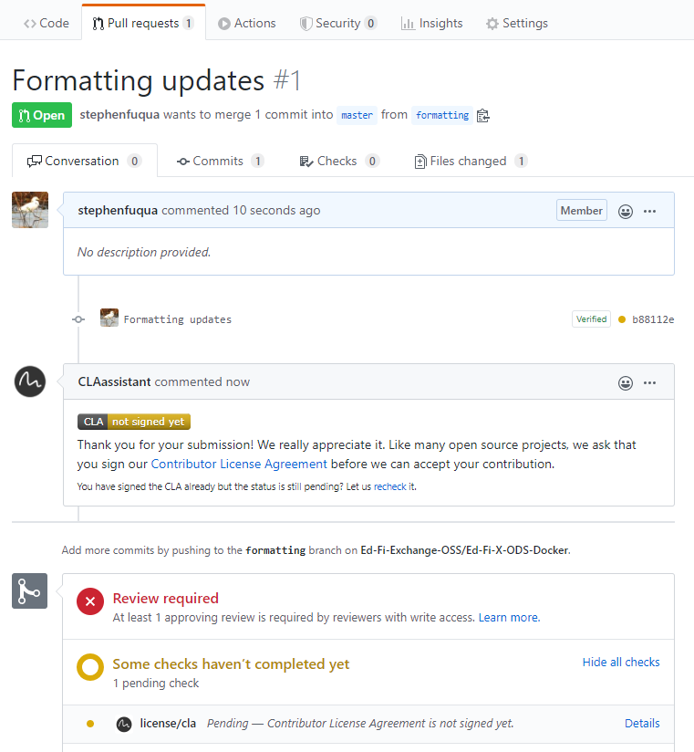
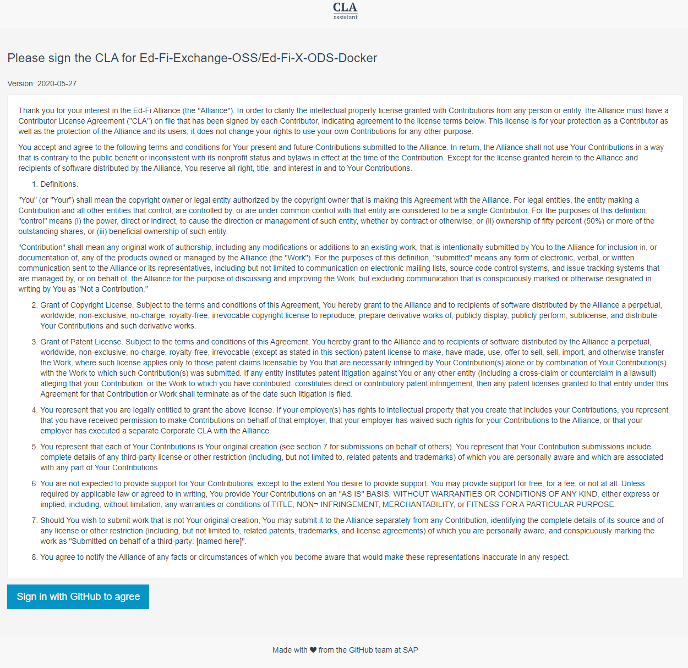
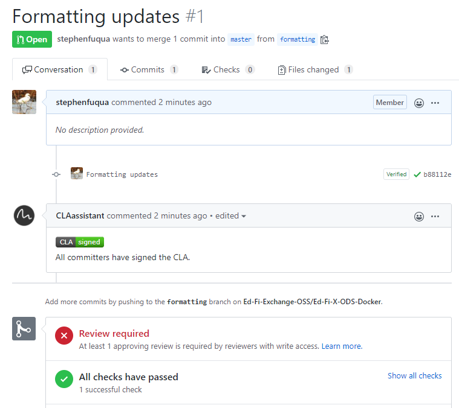

# Individual Contributors License Agreement

Ed-Fi has adopted the Apache Foundation's Individual Contributors License
Agreement as a requirement for accepting a pull request on all open source code
repositories. In summary, [this license
agreement](https://gist.github.com/EdFiBuildAgent/d68fa602d07505c3682e8258b7dc6fbc)
says that you have the right to make this code contribution. Please do read the
details.

Each person will have a one-time request to sign the contributors license
agreement, using their GitHub account. Here's what the process looks like.

1.  First Time Pull Request  
    
2.  Click the "Details" link, seen in the lower right corner of the above
    screenshot.  
3.  Review the license agreement and click the big "Sign in with GitHub to
    agree" button.  
    
4.  After a moment you will be redirected back to the pull request. This may
    take a few seconds - please be patient. Now the PR shows that you have
    signed the agreement, and it is unblocked.  
    
