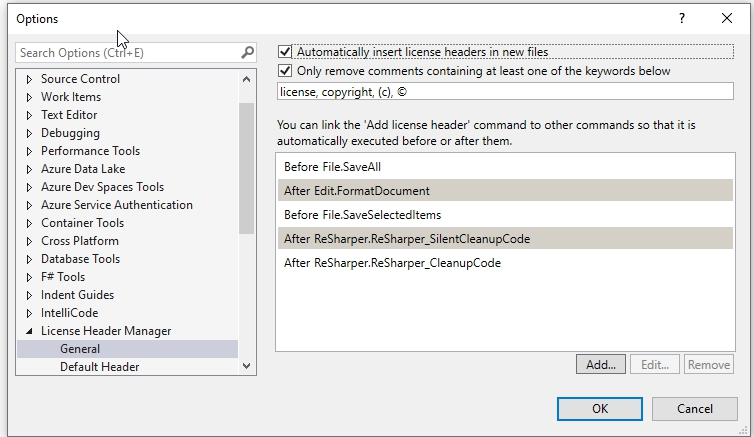
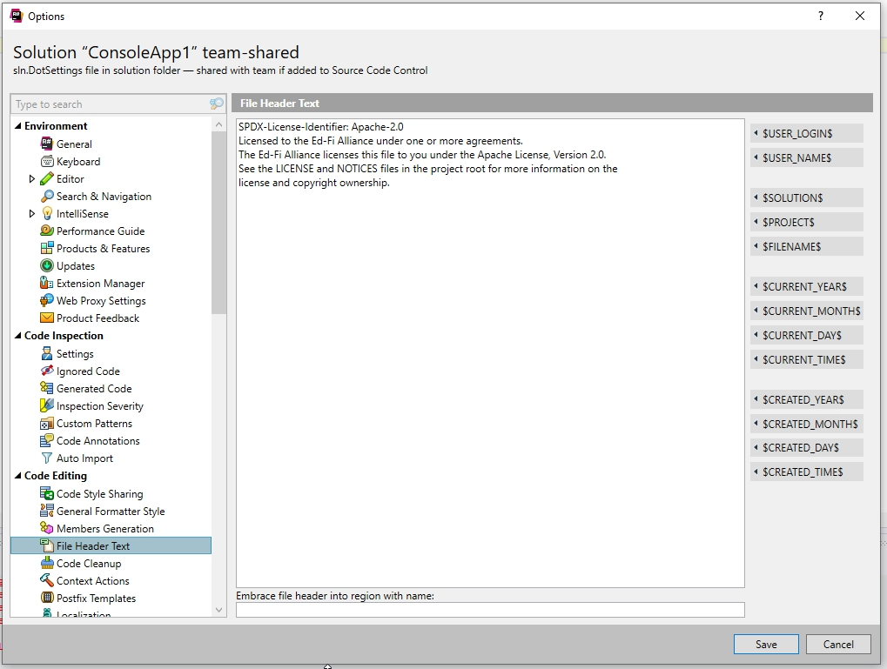

# License and Copyright Notifications

# Overview

As part of the transition to the Apache License, version 2.0, the Ed-Fi Alliance
has chosen to apply a small license and notification statement at the top of
most source code files. The example below would be used in any language that
supports the `//`  style of comments:

**C# File Header**

```
// SPDX-License-Identifier: Apache-2.0
// Licensed to the Ed-Fi Alliance under one or more agreements.
// The Ed-Fi Alliance licenses this file to you under the Apache License, Version 2.0.
// See the LICENSE and NOTICES files in the project root for more information.
```

The LICENSE file will be the Apache License, version 2.0. The NOTICES file will
be patterned on this example:

**NOTICES file**

```
<project name>
Copyright (c) Ed-Fi Alliance, LLC and contributors.

This product includes software developed at the Ed-Fi Alliance (http://www.ed-fi.org/).

<additional notifications as needed, e.g. "Portions of this software related to record-level ownership were developed by the Arizona Department of Education." Any license and copyright information from re-used code or re-distributed libraries should be copied verbatim into this file>
```

:::tip

[Additional samples](https://github.com/Ed-Fi-Alliance/OSS-Sample/tree/master/SampleFileHeaders)
are in the OSS-Sample repository, along with a
[script](https://github.com/Ed-Fi-Alliance/OSS-Sample/blob/master/InsertFileHeaders.ps1)
to modify all files in an existing directory.

:::

# Rationale

In short, the header allows the Alliance to inform any reader of the appropriate
license and how to find more information on copyright, thus eliminating the
"plausible deniability" argument if a reader improperly uses the source code
file.

This is a common practice across the non-profit sector; see for example:

- [.NET
  Foundation](https://github.com/dotnet/foundation/blob/master/guidance/copyright.md)
- [Apache Foundation](https://www.apache.org/legal/src-headers.html)
- [Eclipse Foundation](https://www.eclipse.org/legal/guidetolegaldoc2.php)

# Applicability

The header will be applied, with correct comment syntax, in the following file
types in source repositories that use the Apache license:

- C# (\*.cs)
- JavaScript (.js)

  :::warning

  If the project includes a copy of third-party JavaScript files,
  e.g. jQuery, then that file *should not* have the Ed-Fi file header in it.

  :::

- HTML/Razor pages (\*.\*html)
- MetaEd (\*.metaded)
  
  :::warning

  Only applies to MetaEd files in the public repositories, e.g.
  Ed-Fi-ODS-Implementation. There is no need to put the header on the core
  data model files since they are not covered by the Apache license.

  :::

- PowerShell (\*.ps, \*.psm1, \*.psd1)
- Python (\*.py)
- SQL  (\*.sql)

Generated code that is not stored in the repository or distributed to the
community do not need headers. Thus SQL files created by MetaEd that are bundled
into NuGet packages do need headers, but C# files created by the Code Gen
utility do not need headers.

Out of scope: XML data files, config files of any type, text files including
markdown. Non-exhaustive list:

- \*.xml, \*.xsd
- \*.config
- \*.json
- \*.txt
- \*.md
- \*.csproj
- \*.sln
- \*.bat, \*.cmd (arguably like PowerShell but they don't contain much logic,
  are infrequent, and generally not worth the effort).
- \*.nuspec
- \*.css

# Tool Support for License Headers

## Visual Studio

Install VS Studio Extension [License Header
Manager](https://marketplace.visualstudio.com/items?itemName=StefanWenig.LicenseHeaderManager)

Add configuration as below (works with Reshaper)



Setup the header template to be as follows:

<details>
<summary>Expand source</summary>

```
extensions: designer.cs generated.cs xml .config .xsd .json .xsd .xml aspx .ascx
extensions: .cs .cpp .h .js
// SPDX-License-Identifier: Apache-2.0
// Licensed to the Ed-Fi Alliance under one or more agreements.
// The Ed-Fi Alliance licenses this file to you under the Apache License, Version 2.0.
// See the LICENSE and NOTICES files in the project root for more information.

extensions:  .cshtml .html
<!--
  SPDX-License-Identifier: Apache-2.0
  Licensed to the Ed-Fi Alliance under one or more agreements.
  The Ed-Fi Alliance licenses this file to you under the Apache License, Version 2.0.
  See the LICENSE and NOTICES files in the project root for more information.
-->
extensions: .sql
-- SPDX-License-Identifier: Apache-2.0
-- Licensed to the Ed-Fi Alliance under one or more agreements.
-- The Ed-Fi Alliance licenses this file to you under the Apache License, Version 2.0.
-- See the LICENSE and NOTICES files in the project root for more information.


```

</details>

If Resharper is installed, add the license text content in the team-shared
Resharper file.

Note, exclude any comment indicators.



<details>
<summary>Expand source</summary>

```markdown
SPDX-License-Identifier: Apache-2.0
Licensed to the Ed-Fi Alliance under one or more agreements.
The Ed-Fi Alliance licenses this file to you under the Apache License, Version 2.0.
See the LICENSE and NOTICES files in the project root for more information.
```

</details>

## Visual Studio Code

Install the [psionic File Header
extension](https://marketplace.visualstudio.com/items?itemName=psioniq.psi-header).
Then add the following configuration to the .vscode/settings.json file in each
applicable repository and commit to Git:

<details>
<summary> Expand source </summary>

```json
{
    "files.associations": {
        "*.metaed": "csharp"
    },
    "psi-header.config": {
        "forceToTop": true,
        "blankLinesAfter": 1,
        "license": "Custom"
    },
    "psi-header.templates": [
        {
            "language": "*",
            "template": [
                "SPDX-License-Identifier: Apache-2.0",
                "Licensed to the Ed-Fi Alliance under one or more agreements.",
                "The Ed-Fi Alliance licenses this file to you under the Apache License, Version 2.0.",
                "See the LICENSE and NOTICES files in the project root for more information."
            ]
        }
    ],
    "psi-header.lang-config":[
        {
            "_": "Apply double slash-based comments",
            "language": "csharp",
			"begin": "",
			"end": "",
			"prefix": "// "
        },
        {
            "language": "javascript",
            "mapTo": "csharp"
        },
        {
            "language": "typescript",
            "mapTo": "csharp"
        },
        {
            "language": "metaed",
            "mapTo": "csharp"
        },
        {
            "_": "Apply hash-based comments",
            "language": "python",
			"begin": "",
			"end": "",
			"prefix": "# "
        },
        {
            "language": "powershell",
            "mapTo": "python"
        },
        {
            "language": "dockerfile",
            "mapTo": "python"
        },
        {
            "_": "Apply double dash-based comments",
            "language": "sql",
			"begin": "",
			"end": "",
			"prefix": "-- "
        }
    ],
    "psi-header.changes-tracking": {
        "autoHeader": "autoSave",
        "exclude": [
            "css", "json", "xml", "config", "plaintext", "markdown", "batch"
        ]
    }
}
```

</details>

:::tip

If any files or file types need always have certain lines at the top of
the file, with the license info below it, then you can adjust the extension
via the [ignoreLines
setting](https://marketplace.visualstudio.com/items?itemName=psioniq.psi-header#auto-header).

:::

Default extensions enabled within VS Code using the file
.vscode/extensions.json.

<details>
<summary>Expand source</summary>

```json
{
    "recommendations": [
      "psioniq.psi-header",
      "ms-dotnettools.csharp",
      "ms-vscode.powershell",
      "streetsidesoftware.code-spell-checker"
    ]
}

```

</details>
